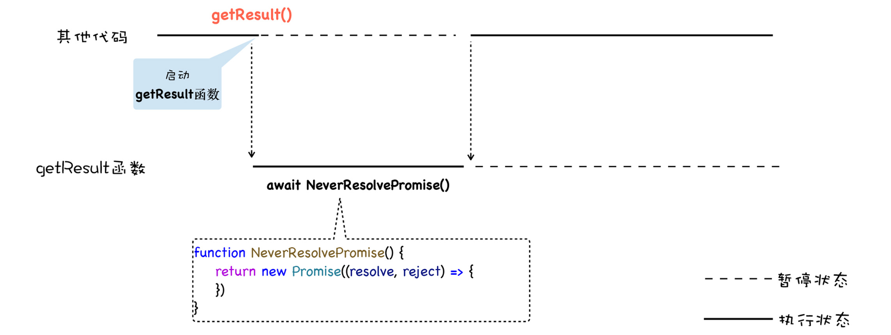
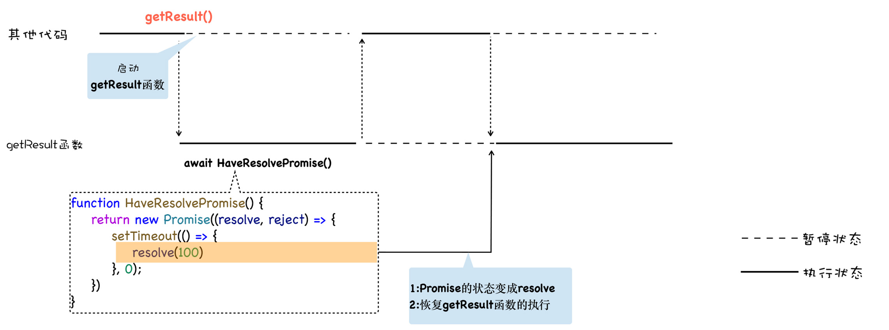

## 异步编程的“终极”方案

**ES7 引入了 async/await，这是 JavaScript 异步编程的一个重大改进，它改进了生成器的缺点，提供了在不阻塞主线程的情况下使用同步代码实现异步访问资源的能力**。
可以参考下面这段使用 async/await 改造后的代码：

```javascript
async function getResult() {
  try {
    let id_res = await fetch(id_url);
    let id_text = await id_res.text();
    console.log(id_text);

    let new_name_url = name_url + "?id=" + id_text;
    console.log(new_name_url);
    let name_res = await fetch(new_name_url);
    let name_text = await name_res.text();
    console.log(name_text);
  } catch (err) {
    console.error(err);
  }
}
getResult();
```

上面代码可以看出，整个异步处理的逻辑都是使用同步代码的方式来实现的，而且还支持 try catch 来捕获异常，这就是完全在写同步代码，所以非常符合人的线性思维。

虽然这种方式看起来像是同步代码，但是实际上它又是异步执行的，也就是说，在执行到 await fetch 的时候，整个函数会暂停等待 fetch 的执行结果，等到函数返回时，再恢复该函数，然后继续往下执行。

**其实 async/await 技术背后的秘密就是 Promise 和生成器应用，往底层说，就是微任务和协程应用**。要搞清楚 async 和 await 的工作原理，就得对 async 和 await 分开分析。

先来看看 async 到底是什么。根据 MDN 定义，async 是一个**通过异步执行并隐式返回 Promise 作为结果的函数**。

这里需要重点关注异步执行这个词，简单地理解，如果在 async 函数里面使用了 await，那么此时 async 函数就会暂停执行，并等待合适的时机来恢复执行，所以说 async 是一个异步执行的函数。

那么暂停之后，**什么时机恢复 async 函数的执行呢**？

要解释这个问题，先来看看 V8 是如何处理 await 后面的内容的。

通常，await 可以等待两种类型的表达式：

- 可以是任何普通表达式。

- 也可以是一个 Promise 对象的表达式。

如果 await 等待的是一个 Promise 对象，它就会暂停执行生成器函数，**直到 Promise 对象的状态变成 resolve，才会恢复执行，然后得到 resolve 的值，作为 await 表达式的运算结果**。

我们看下面这样一段代码：

```javascript
function NeverResolvePromise() {
  return new Promise((resolve, reject) => {});
}
async function getResult() {
  let a = await NeverResolvePromise();
  console.log(a);
}
getResult();
console.log(0);
```

这一段代码，我们使用 await 等待一个没有 resolve 的 Promise，那么这也就意味着，getResult 函数会一直等待下去。

和生成器函数一样，使用了 async 声明的函数在执行时，也是一个单独的协程，我们可以使用 await 来暂停该协程，由于 await 等待的是一个 Promise 对象，我们可以 resolve 来恢复该协程。

下面从协程的视角，画的这段代码的执行流程图，你可以对照参考下：



如果 await 等待的对象已经变成了 resolve 状态，那么 V8 就会恢复该协程的执行，可以修改下上面的代码，来证明下这个过程：

```javascript
function HaveResolvePromise() {
  return new Promise((resolve, reject) => {
    setTimeout(() => {
      resolve(100);
    }, 0);
  });
}
async function getResult() {
  console.log(1);
  let a = await HaveResolvePromise();
  console.log(a);
  console.log(2);
}
console.log(0);
getResult();
console.log(3);
//输出 0 1 3 100 2
```

现在，这段代码的执行流程就非常清晰了，具体执行流程你可以参看下图：



如果 await 等待的是一个非 Promise 对象，比如 await 100，那么通用 V8 会**隐式地将 await 后面的 100 包装成一个已经 resolve 的对象**，其效果等价于下面这段代码：

```javascript
function ResolvePromise() {
  return new Promise((resolve, reject) => {
    resolve(100);
  });
}
async function getResult() {
  let a = await ResolvePromise();
  console.log(a);
}
getResult();
console.log(3);
```
