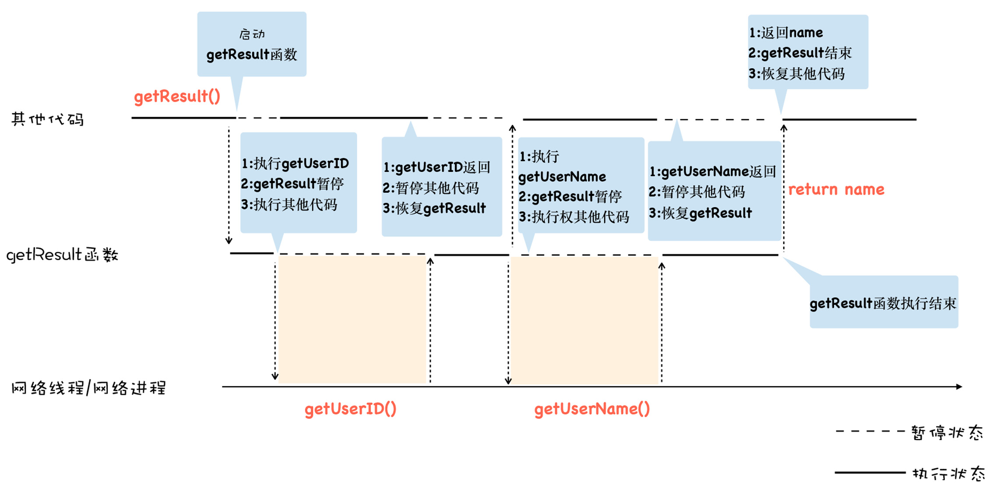
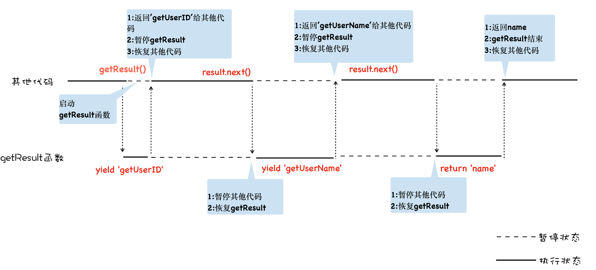

## 使用 Generator 函数实现更加线性化逻辑

虽然使用 Promise 可以解决回调地狱中编码不线性的问题，但这种方式充满了 Promise 的 then() 方法，如果处理流程比较复杂的话，那么整段代码将充斥着大量的 then，异步逻辑之间依然被 then 方法打断了，因此这种方式的语义化不明显，代码不能很好地表示执行流程。

```javascript
function getResult() {
  let id = getUserID();
  let name = getUserName(id);
  return name;
}
```

由于 getUserID() 和 getUserName() 都是异步请求，如果要实现这种线性的编码方式，那么一个可行的方案就是**执行到异步请求的时候，暂停当前函数，等异步请求返回了结果，再恢复该函数**。

具体地讲，执行到 getUserID() 时暂停 GetResult 函数，然后浏览器在后台处理实际的请求过程，待 ID 数据返回时，再来恢复 GetResult 函数。接下来再执行 getUserName 来获取到用户名，由于 getUserName() 也是一个异步请求，所以在使用 getUserName() 的同时，依然需要暂停 GetResult 函数的执行，等到 getUserName() 返回了用户名数据，再恢复 GetResult 函数的执行，最终 getUserName() 函数返回了 name 信息。

这个思维模型大致如下所示：



模型的关键就是实现**函数暂停执行**和**函数恢复执行**，而生成器就是为了实现暂停函数和恢复函数而设计的。

**生成器函数是一个带星号函数，配合 yield 就可以实现函数的暂停和恢复**，我们看看生成器的具体使用方式：

```javascript
function* getResult() {
  yield "getUserID";
  yield "getUserName";
  return "name";
}
let result = getResult();
console.log(result.next().value); // getUserID
console.log(result.next().value); // getUserName
console.log(result.next().value); // name
```

## V8 是怎么实现生成器函数的暂停执行和恢复执行的呢？

这背后的魔法就是**协程，协程是一种比线程更加轻量级的存在**。你可以把协程看成是跑在线程上的任务，一个线程上可以存在多个协程，但是在线程上同时只能执行一个协程。比如，当前执行的是 A 协程，要启动 B 协程，那么 A 协程就需要将主线程的控制权交给 B 协程，这就体现在 A 协程暂停执行，B 协程恢复执行；同样，也可以从 B 协程中启动 A 协程。通常，**如果从 A 协程启动 B 协程，我们就把 A 协程称为 B 协程的父协程**。

正如一个进程可以拥有多个线程一样，一个线程也可以拥有多个协程。每一时刻，该线程只能执行其中某一个协程。最重要的是，协程不是被操作系统内核所管理，而完全是由程序所控制（也就是在用户态执行）。这样带来的好处就是性能得到了很大的提升，不会像线程切换那样消耗资源。

为了让你更好地理解协程是怎么执行的，结合上面那段代码的执行过程，画出了下面的“**协程执行流程图**”，可以对照着代码来分析：



其实在 JavaScript 中，生成器就是协程的一种实现方式，这样，也就理解什么是生成器了。

## 如何保存 generator 需要执行上下文

普通函数在被调用时，JS 引擎会创建一个栈帧，在里面准备好局部变量、函数参数、临时值、代码执行的位置（也就是说这个函数的第一行对应到代码区里的第几行机器码），在当前栈帧里设置好返回位置，然后将新帧压入栈顶。待函数执行结束后，这个栈帧将被弹出栈然后销毁，返回值会被传给上一个栈帧。

当执行到 yield 语句时，Generator 的栈帧同样会被弹出栈外，但 Generator 在这里耍了个花招——它在堆里保存了栈帧的引用（或拷贝）！这样当 it.next 方法被调用时，JS 引擎便不会重新创建一个栈帧，而是把堆里的栈帧直接入栈。因为栈帧里保存了函数执行所需的全部上下文以及当前执行的位置，所以当这一切都被恢复如初之时，就好像程序从原本暂停的地方继续向前执行了。

而因为每次 yield 和 it.next 都对应一次出栈和入栈，所以可以直接利用已有的栈机制，实现值的传出和传入。
