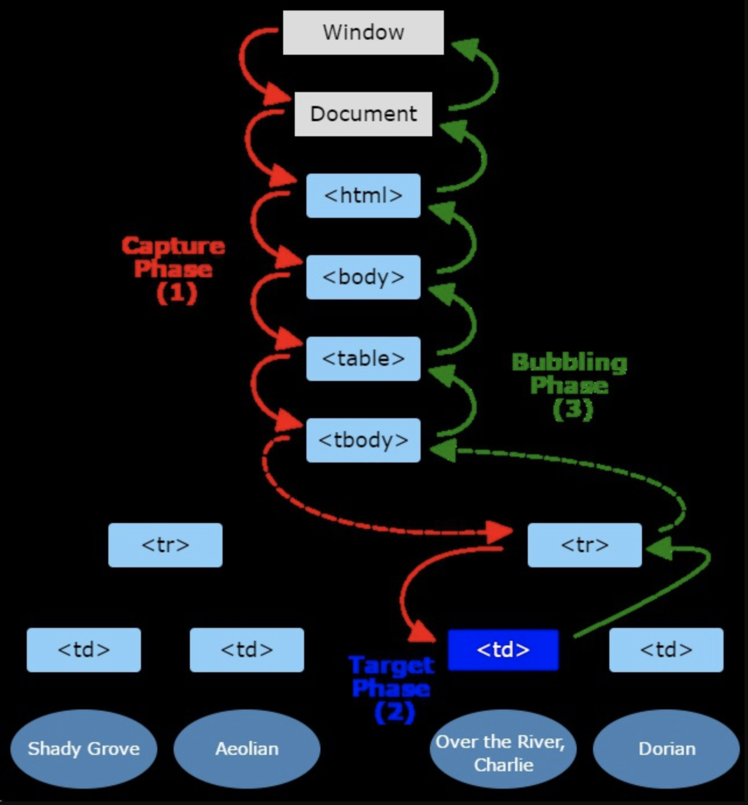

# DOM事件模型

## 事件模型

- DOM 0级
  
  以上事件模型并非 W3C 的 DOM 标准，它是在 DOM 标准形成前（Internet Explorer 8 及更早IE版本）的事件模型。尽管没有成为正式的 W3C 标准，但它仍然得到广泛应用，这就是我们通常所说的 0级 DOM 事件模型。

- 没有1级DOM
  
  DOM级别1 于1998年10月1日成为W3C推荐标准。1级DOM标准中并没有定义事件相关的内容，所以没有所谓的1级DOM事件模型。

- DOM 2级

  在2级DOM中除了定义了一些DOM相关的操作之外，还定义了一个事件模型，这个标准下的事件模型就是我们所说的2级DOM事件模型。


## 事件流

事件流描述的就是从页面中接受事件的顺序。有事件冒泡、事件捕获两种。

DOM 0级：目标阶段-冒泡阶段。

DOM 2级：捕获阶段-目标阶段-冒泡阶段

DOM事件流有三个阶段：

- 事件捕获阶段
- 处于目标阶段
- 事件冒泡阶段



可以通过`addEventListener`注册事件时声明捕获还是冒泡阶段（第三个参数），处于捕获阶段的事件会比冒泡阶段先发生。

## 事件冒泡

事件冒泡是 IE 的事件流，事件是由最具体的元素接收，然后逐级向上传播，在每一级的节点上都会发生，直到传播到document对象，向Chrome这样的浏览器会冒泡到window 对象（很容易记忆，联想水里的泡泡不也这样么）。

## 事件捕获

事件捕获是Netscape浏览器开发团队提出的，很有意思，他们思想和IE 的截然相反。也就是说，从不具体的节点到最具体的节点，一般是从document对象开始传播，不过很少人用事件捕获的，还是事件冒泡用的多。

## 事件处理程序

- DOM 0级

  ```js
  <button onclick="doSomething()">点击</button>
  或者
  document.getElementById('btn').onclick = function(){
    console.log('被点击了！');
  };

  // 移除事件处理程序
  document.getElementById('btn').onclick = null;
  ```

  IE 事件处理程序

  ```js
  // 事件绑定监听函数
  attachEvent(eventType, listener)

  // 事件移除监听函数
  detachEvent(eventType, listener)
  ```

- DOM 2级

  ```js
    // DOM 2级事件处理方式
    document.getElementById("myButton").addEventListener(
      "click",
      function (event) {
          alert("Button Click");
          console.log(event)
      },
      true // true表示使用捕获，false表示使用冒泡
    )

    // 移除事件处理程序
    document.getElementById("myButton").removeEventListener('click', function() {});
    ```


## 事件对象

- DOM事件模型中的事件对象常用属性:
  1. type：用于获取事件类型
  2. target：获取事件目标
  3. stopPropagation()：阻止事件冒泡
  4. preventDefault()：阻止事件默认行为


- IE事件模型中的事件对象常用属性:
  1. type：用于获取事件类型
  2. srcElement：获取事件目标
  3. cancelBubble：阻止事件冒泡
  4. returnValue：阻止事件默认行为


## 事件委托/代理

优势：
- 节省内存占用，减少事件注册
- 新增子对象时无需再次对其绑定事件，适合动态添加元素

```html
<ul id="parent">
  <li class="child">one</li>
  <li class="child">two</li>
  <li class="child">three</li>
</ul>

<script type="text/javascript">
  //父元素
  var dom= document.getElementById('parent');

  //父元素绑定事件，代理子元素的点击事件
  dom.onclick= function(event) {
    var event= event || window.event;
    var curTarget= event.target || event.srcElement;

    if (curTarget.tagName.toLowerCase() == 'li') {
      //事件处理
    }
  }
</script>
```
