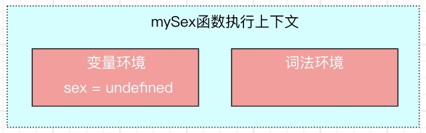

# js执行的一些基本概念

### 执行上下文 - Execution context

编写js代码之后，并非直接就能在浏览器上执行。它是需要经过js引擎编译，并将编译后代码存入内存，然后才能执行。

并且js编译是一个很复杂的过程，它会涉及到语法/词法分析、代码优化、代码生成。


js经过引擎的编译之后，代码会被分成两大部分：
- 可执行代码
- 执行上下文

下图以一段简单的代码为例，描述编译的结果。

```js
var name = '张三';
function introduce() {
  console.log('my name is' + name);
}
introduce();
```


执行上下文是执行一段js代码时的运行环境，包含：
- 变量环境 - Viriable Environment
- 词法环境 - Lexicaln Environment

它的作用就是确定某段代码在执行时所使用的到的变量、函数等。

在继续讲解之前我们需要先理解一个小知识点：声明、赋值。

- 先看普通变量：

```js
var name = '张三';
```

上面这句代码，可以理解成由声明、赋值两个操作组成。

```js
// 声明
var name = undefined;
// 赋值
name = '张三';
```
- 再看函数：

```js
// 第一种方式
var func = function() {};
// 第二种方式
function func() {}
```
第一种方式，跟普通变量是一样可以拆分为：声明、赋值。

第二种方式，则不涉及赋值操作，它是一个完整的函数声明。
```js
// 第一种方式
// 声明
var func = undefined;
// 赋值
func = function() {};
```

了解完声明、赋值这个小知识点。我们可以将之前的代码看成是以下代码：

```js
var name = undefined
name = '张三';
function introduce() {
  console.log('my name is' + name);
}
introduce();
```

现在，我们简单分析下以上代码的编译阶段（仅介绍变量环境的生成）。

- 引擎遇到第一行代码时，发现这是一个var声明语句，会在变量环境中生成一个名为name的属性，同时将name的值初始化为undefined。
- 引擎遇到第二行代码时，发现这是一个非声明语句，编译成字节码，存放在可执行代码中。
- 引擎遇到第三行代码时，发现它是一个完整的函数声明，会在变量环境中生成一个名为introduce的属性，同时将introduce的值初始化为函数在堆(Head)中的内存地址。
- 引擎遇到第四行代码时，发现这是一个非声明语句，编译成字节码，存放在可执行代码中。

```js
// 抽象出来的变量环境
name -> undefined,
introduce -> 0xffffff // 函数实际存放在堆中
```

```js
// 抽象出来的可执行代码
name = '张三';
introduce();
```

我们再看看执行阶段又是如何执行的。

- 执行第一行代码时，js引擎会在变量环境中查找name，发现变量环境中存在name变量，然后会将'张三'赋值给name变量，这样name的属性值就会变成'张三'。
- 执行第二行代码时，js引擎会在变量环境中查找introduce函数，发现变量环境中存在introduce变量，并且指向堆的地址是有效的，就会执行introduce函数。


### 执行上下文的管理

执行上下文有三类：
- 全局执行上下文
- 函数执行上下文
- eval执行上下文

全局执行上下文，是在执行全局代码时产生的，有且仅有一个，生命周期跟随页面，页面关闭立即销毁。

函数执行上下文，是在执行某个函数时产生的，生命周期跟随这个函数，函数执行完毕后立即销毁。

我们分析下下面这段代码：

```js
var name = '张三';
function mySex() {
  var sex = '男生';
  console.log('我是个' + sex);
}
function introduce() {
  console.log('我叫' + name);
  mySex();
}
introduce();
```

- 首先会创建一个全局执行上下文


- 执行到introduce()时，会编译introdeuce函数，创建一个函数执行上下文


- 执行到mySex()时，同样会编译mySex函数，又会创建一个函数执行上下文




上面这段代码是一段很简单的代码，都已经创建了3个执行上下文。通常情况下，我们要实现一个交互较多的页面，它对应的js代码就会很复杂，可能会存在多个函数连续调用、嵌套调用的情况，这个时候js引擎就会创建多个执行上下文。那么就有个问题：***这么多的执行上下文，js引擎是如何管理的呢***？

***在js引擎中是通过栈来管理执行上下文的***。

***栈，是一种数据结构。具有先入后出的特性***。

我们可以通过叠盘子这件事情来形象的理解栈是什么。我们在洗盘子的时候，先洗好的盘子总是放在下面，后面洗好的盘子则是一个一个的往上叠。当要使用盘子时，则是从最上面一个一个的往下取用。叠放盘子，就是入栈。取用盘子就是出栈。当然 ***栈是有大小限制的***，就像我们不可能无限的往上面叠盘子，到达一定高度后它就会坍塌一样。对应到js引擎中，这就叫做：***栈溢出 - Stack Overflow***。所以在实际开发过程中需要注意不要循环引用，递归调用要有终止条件。


在js中用来管理执行上下文的栈叫做：***调用栈 - Call Stack***。

在Chrome浏览器中我们可以通过下面这种方式来查看调用栈的情况。栈的最底部是 anonymous，即全局的函数入口。


也可以通过console.trace()来追踪函数的调用过程。


接下来，我们结合Chrome浏览器提供的信息分析以上代码的调用栈使用过程。

- 首先是创建全局执行上下文，并压入调用栈。


- 执行introduce函数时，编译函数，创建introduce函数执行上下文，压入栈。


- 执行mySex函数时，编译函数，创建mySex函数执行上下文，压入栈。


- mySex函数执行完毕时，mySex函数执行上下文从栈顶弹出。


- introduce函数执行完毕时，introduce函数执行上下文从栈顶弹出。


从上面的使用过程来看，***调用栈其实也是一种追踪函数执行的机制***。通过调用栈，我们可以很清楚的知道，当前正在被执行的是哪个函数，它与其他函数之间的调用关系。

### ES6是如何实现块级作用域的

在解答标题之前，我们先理清楚 ***作用域*** 这个概念。

***作用域，即限定某个变量、函数可用性的代码范围***。

ES6推出前js只有两种作用域：

- ***全局作用域***，该作用域中的变量、函数在整个代码范围内都可用，直至页面被关闭。
- ***函数作用域***，该作用域中的变量、函数只在定义它们的函数内可用，外部无法访问。函数执行结束之后，这些变量、函数会被销毁。

ES6通过let、const引入了第三种作用域：***块级作用域***，即使用一对大括号({})包裹的一段代码范围，该作用域内的变量、函数只在定义它们的{}内可用，外部无法访问。

通过上文的介绍，相信大家都知道，代码执行前的编辑阶段，会将变量、函数放入执行上下文的变量环境中，执行时会在执行上下文的变量环境中查找需要使用的变量、函数。

在变量环境中，重名的变量、函数，后者必然会覆盖前者。那么ES6是如何实现在同一个执行上下文中let、const声明的变量，与var声明的变量不冲突的？或者说它是如何实现块级作用域的呢？

```js
function introduce(){
    var name_1 = '张三'
    let name_2 = '李四'
    {
      let name_2 = '王五'
      var name_3 = '陈六'
      let name_4 = '无名'
      console.log(name_1)
    }
}   
introduce()
```


上述代码会先创建函数上下文，从图中可以看出：

- 通过 var 声明的变量，都会被放到变量环境中（考虑变量提升：name_3）

- 通过 let 声明的变量，都会被放到词法环境中

函数体内代码块中通过 let 声明的变量(name_2、name_4)，并没有被马上放到词法环境中。直至代码执行到代码块：


从图中可以看出，代码块中通过 let 声明的变量会在词法环境中使用单独的区域存放。它与代码块外部通过 let 声明的变量都是独立存在的，互不影响。

同时也可以看出js引擎也是通过 ***栈*** 来管理词法环境内部的。栈底是函数内最外层的变量(let\const声明)，栈顶是当前正在执行的代码块内部变量(let\const声明)，一旦代码块内部代码执行完毕，就会被弹出栈顶。

当执行到console.log(name_1)时，js引擎是如何查找变量的呢？


js引擎会先从词法环境的栈顶查到栈底，查到就直接返回，不然就会继续在变量环境中查找。代码块内的代码执行完毕之后，代码块内部定义的变量(let\const声明)就会被弹出栈顶。


通过上面简单的解释，能清楚的知道ES6是通过将let\const声明的变量存放在词法环境，var声明的变量存放在变量环境中，来避免了两种不同声明方式的重名冲突。

同时也清楚的知道ES6是通过词法环境的栈结构来实现块级作用域的。


### 作用域链的本质

```js
var name = '张三';
function me() {
   console.log('我叫' + name);
}
function introduce() {
  var name = '李四';
  me();
}
introduce();
```

回顾调用栈，我们知道上述代码的调用栈道结构如下：


如果按照调用栈的顺序查找name变量，console.log('我叫' + name)打印出来的应该是“我叫李四”。

但是实际的代码执行结果却是“我是张三”。这是什么原因呢？

在执行上下文的变量环境中，其实是存在一个特殊的变量：outer，它指向外部的执行上下文。

js引擎在查找变量时并不是完全按照调用栈的顺序来查找的。当在当前执行上下文没有找到变量时，引擎会到outer指向的外部执行上下中继续查找。


***沿着outer所形成的查找链条就是作用域链***。

我们可能有个疑问：为什么me函数执行上下的外部引用指向的是全局执行上下文，而不是introduce函数执行上下文？

这里面涉及到另外一个概念：***词法作用域***。

词法作用域是由代码中函数声明的位置来决定的。

词法作用域是静态的作用域。

通俗点讲就是函数在声明的时候它的作用域链就已经被固定下来了，而不是代码执行时，跟函数的调用没有关系。

下面是最常规的，也是最符合我们视觉思维的作用域链：

```js
var num = 1;
function show1() {
  var num = 2;
  function show2() {
    console.log(num);
  }
  show2();
}
show1();
```

