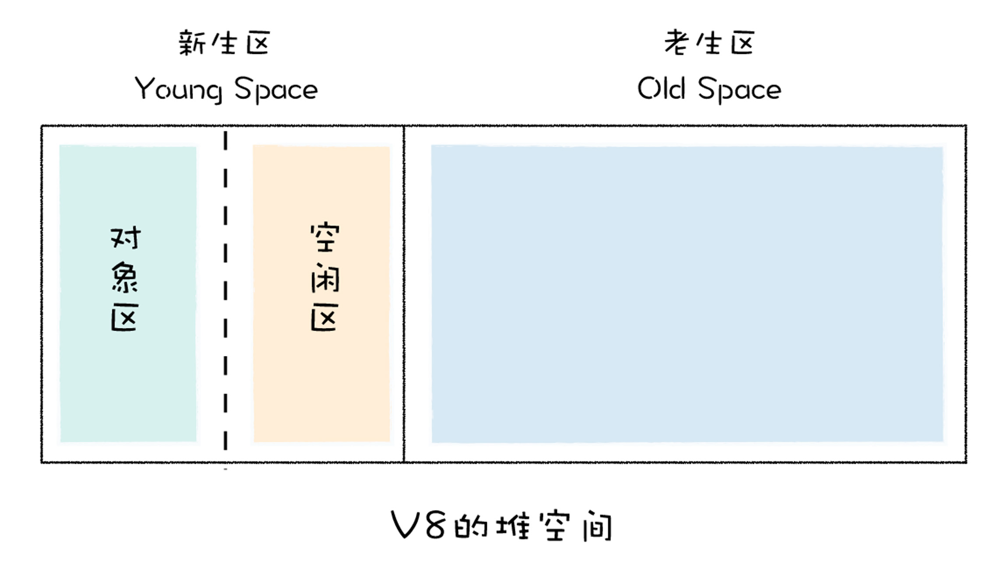
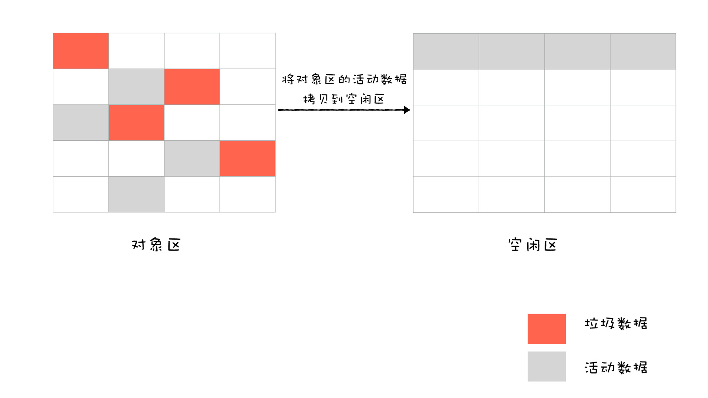
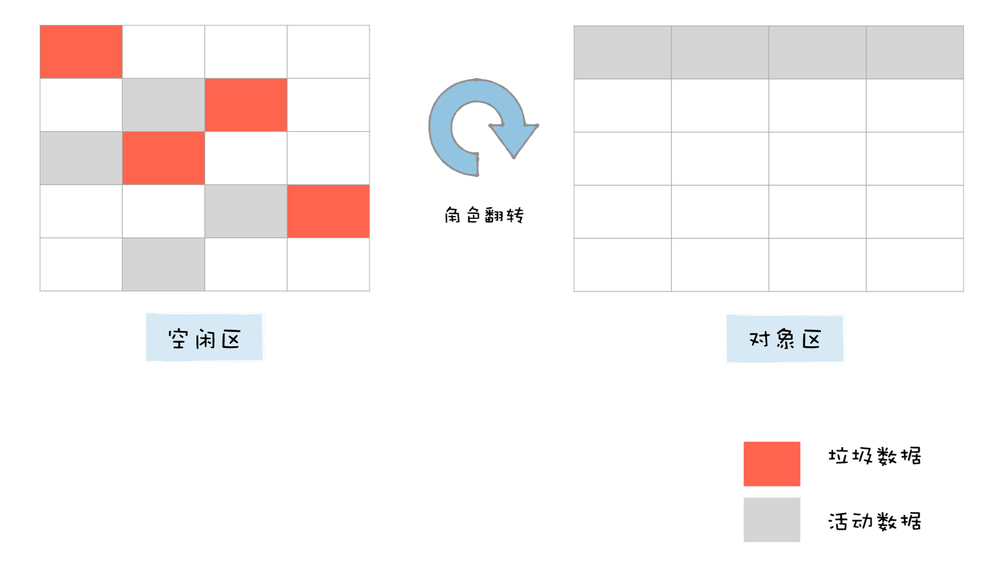
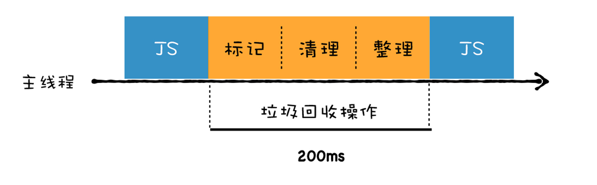
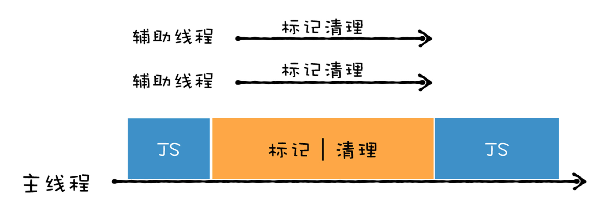
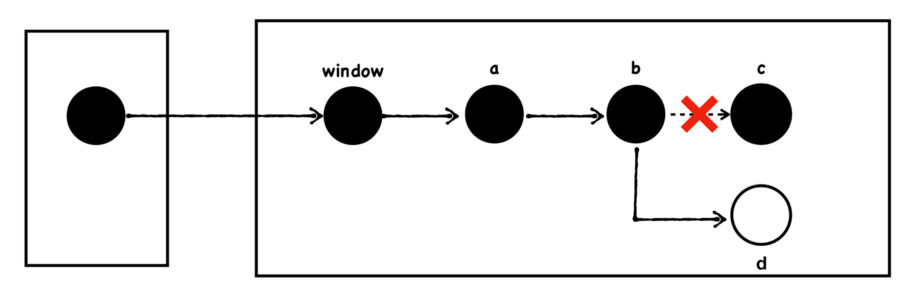
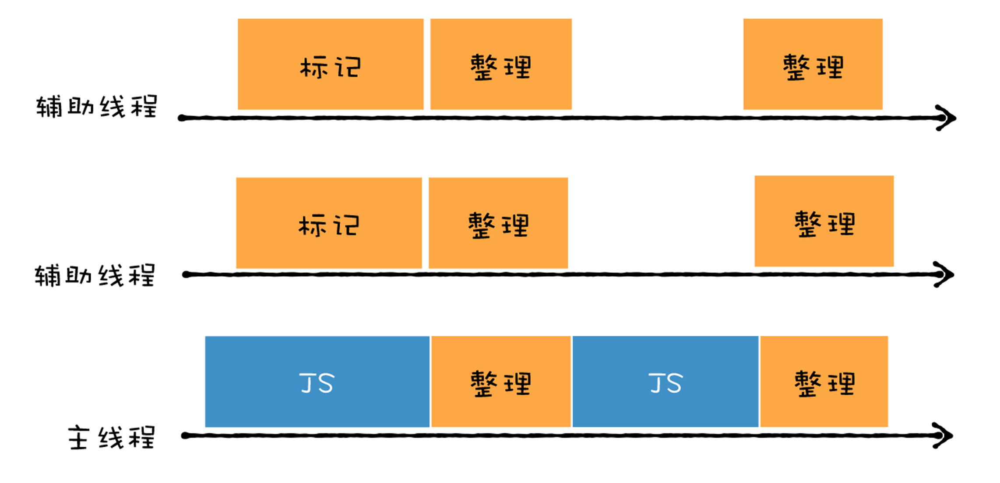

# 垃圾回收算法

垃圾回收大致可以分为以下几个步骤：

第一步，通过 GC Root 标记空间中<strong style="color: #f66;">活动对象</strong>和<strong style="color: #f66;">非活动对象</strong>。

目前 V8 采用的<strong style="color: #f66;">可访问性（reachability）算法</strong>来判断堆中的对象是否是活动对象。具体地讲，这个算法是将一些 <strong style="color: #f66;">GC Root</strong> 作为初始存活的对象的集合，从 GC Roots 对象出发，遍历 GC Root 中的所有对象：

- 通过 GC Root 遍历到的对象，我们就认为该对象是<strong style="color: #f66;">可访问的（reachable）</strong>，那么必须保证这些对象应该在内存中保留，我们也称可访问的对象为活动对象；

- 通过 GC Roots 没有遍历到的对象，则是<strong style="color: #f66;">不可访问的（unreachable）</strong>，那么这些不可访问的对象就可能被回收，我们称不可访问的对象为非活动对象。

在浏览器环境中，GC Root 有很多，通常包括了以下几种 (但是不止于这几种)：
- 全局的 window 对象（位于每个 iframe 中）；
- 文档 DOM 树，由可以通过遍历文档到达的所有原生 DOM 节点组成；
- 存放栈上变量。

第二步，回收非活动对象所占据的内存。其实就是在所有的标记完成之后，统一清理内存中所有被标记为可回收的对象。

第三步，做内存整理。一般来说，频繁回收对象后，内存中就会存在大量不连续空间，我们把这些不连续的内存空间称为<strong style="color: #f66;">内存碎片</strong>。当内存中出现了大量的内存碎片之后，如果需要分配较大的连续内存时，就有可能出现内存不足的情况，所以最后一步需要整理这些内存碎片。但这步其实是可选的，因为有的垃圾回收器不会产生内存碎片，比如接下来我们要介绍的副垃圾回收器。

以上就是大致的垃圾回收的流程。目前 V8 采用了两个垃圾回收器，<strong style="color: #f66;">主垃圾回收器 -Major GC</strong> 和 <strong style="color: #f66;">副垃圾回收器 -Minor GC (Scavenger)</strong>。V8 之所以使用了两个垃圾回收器，主要是受到了<strong style="color: #f66;">代际假说（The Generational Hypothesis）</strong>的影响。

代际假说是垃圾回收领域中一个重要的术语，它有以下两个特点：

- 第一个是大部分对象都是“朝生夕死”的，也就是说大部分对象在内存中存活的时间很短，比如函数内部声明的变量，或者块级作用域中的变量，当函数或者代码块执行结束时，作用域中定义的变量就会被销毁。因此这一类对象一经分配内存，很快就变得不可访问；

- 第二个是不死的对象，会活得更久，比如全局的 window、DOM、Web API 等对象。

其实这两个特点不仅仅适用于 JavaScript，同样适用于大多数的动态语言，如 Java、Python 等。

V8 的垃圾回收策略，就是建立在该假说的基础之上的。接下来，我们来分析下 V8 是如何实现垃圾回收的。

如果我们只使用一个垃圾回收器，在优化大多数新对象的同时，就很难优化到那些老对象，因此你需要权衡各种场景，根据对象生存周期的不同，而使用不同的算法，以便达到最好的效果。

所以，在 V8 中，会把堆分为新生代和老生代两个区域，<strong style="color: #f66;">新生代中存放的是生存时间短的对象，老生代中存放生存时间久的对象</strong>。

新生代通常只支持 1～8M 的容量，而老生代支持的容量就大很多了。对于这两块区域，V8 分别使用两个不同的垃圾回收器，以便更高效地实施垃圾回收。

- <strong style="color: #f66;">副垃圾回收器 -Minor GC (Scavenger)，主要负责新生代的垃圾回收。</strong>
- <strong style="color: #f66;">主垃圾回收器 -Major GC，主要负责老生代的垃圾回收。</strong>

## 副垃圾回收器

副垃圾回收器主要负责新生代的垃圾回收。通常情况下，大多数小的对象都会被分配到新生代，所以说这个区域虽然不大，但是垃圾回收还是比较频繁的。

新生代中的垃圾数据用 <strong style="color: #f66;">Scavenge 算法</strong>来处理。所谓 Scavenge 算法，是把新生代空间对半划分为两个区域，一半是<strong style="color: #f66;">对象区域 (from-space)</strong>，一半是<strong style="color: #f66;">空闲区域 (to-space)</strong>，如下图所示：



新加入的对象都会存放到对象区域，当对象区域快被写满时，就需要执行一次垃圾清理操作。

在垃圾回收过程中，首先要对对象区域中的垃圾做标记；标记完成之后，就进入垃圾清理阶段。副垃圾回收器会把这些存活的对象复制到空闲区域中，同时它还会把这些对象有序地排列起来，所以这个复制过程，也就相当于完成了内存整理操作，复制后空闲区域就没有内存碎片了。




完成复制后，对象区域与空闲区域进行角色翻转，也就是原来的对象区域变成空闲区域，原来的空闲区域变成了对象区域。这样就完成了垃圾对象的回收操作，同时，<strong style="color: #f66;">这种角色翻转的操作还能让新生代中的这两块区域无限重复使用下去。</strong>



不过，副垃圾回收器每次执行清理操作时，都需要将存活的对象从对象区域复制到空闲区域，复制操作需要时间成本，如果新生区空间设置得太大了，那么每次清理的时间就会过久，所以<strong style="color: #f66;">为了执行效率，一般新生区的空间会被设置得比较小。</strong>

也正是因为新生区的空间不大，所以很容易被存活的对象装满整个区域，副垃圾回收器一旦监控对象装满了，便执行垃圾回收。同时，副垃圾回收器还会采用<strong style="color: #f66;">对象晋升策略</strong>，也就是移动那些经过两次垃圾回收依然还存活的对象到老生代中。

## 主垃圾回收器

主垃圾回收器主要负责老生代中的垃圾回收。除了新生代中晋升的对象，一些大的对象会直接被分配到老生代里。因此，老生代中的对象有两个特点：
- 一个是对象占用空间大；
- 另一个是对象存活时间长。

由于老生代的对象比较大，若要在老生代中使用 Scavenge 算法进行垃圾回收，复制这些大的对象将会花费比较多的时间，从而导致回收执行效率不高，同时还会浪费一半的空间。所以，主垃圾回收器是采用<strong style="color: #f66;">标记 - 清除（Mark-Sweep）</strong>的算法进行垃圾回收的。

那么，标记 - 清除算法是如何工作的呢？

<strong style="color: #f66;">首先是标记过程阶段。</strong>标记阶段就是从一组根元素开始，递归遍历这组根元素，在这个遍历过程中，能到达的元素称为活动对象，没有到达的元素就可以判断为垃圾数据。

<strong style="color: #f66;">接下来就是垃圾的清除过程。</strong>它和副垃圾回收器的垃圾清除过程完全不同，主垃圾回收器会直接将标记为垃圾的数据清理掉。

你可以理解这个过程是清除掉下图中红色标记数据的过程，你可参考下图大致理解下其清除过程：


对垃圾数据进行标记，然后清除，这就是<strong style="color: #f66;">标记 - 清除算法</strong>，不过对一块内存多次执行标记 - 清除算法后，会产生大量不连续的内存碎片。而碎片过多会导致大对象无法分配到足够的连续内存，于是又引入了另外一种算法——<strong style="color: #f66;">标记 - 整理（Mark-Compact）。</strong>

这个算法的标记过程仍然与标记 - 清除算法里的是一样的，先标记可回收对象，但后续步骤不是直接对可回收对象进行清理，而是让所有存活的对象都向一端移动，然后直接清理掉这一端之外的内存。你可以参考下图：


## 总结

先分析了什么是垃圾数据，从“GC Roots”对象出发，遍历 GC Root 中的所有对象，如果通过 GC Roots 没有遍历到的对象，则这些对象便是垃圾数据。V8 会有专门的垃圾回收器来回收这些垃圾数据。

V8 依据代际假说，将堆内存划分为新生代和老生代两个区域，新生代中存放的是生存时间短的对象，老生代中存放生存时间久的对象。为了提升垃圾回收的效率，V8 设置了两个垃圾回收器，主垃圾回收器和副垃圾回收器。主垃圾回收器负责收集老生代中的垃圾数据，副垃圾回收器负责收集新生代中的垃圾数据。

副垃圾回收器采用了 <strong style="color: #f66;">Scavenge 算法</strong>，是把新生代空间对半划分为两个区域，一半是<strong style="color: #f66;">对象区域</strong>，一半是<strong style="color: #f66;">空闲区域</strong>。新的数据都分配在对象区域，等待对象区域快分配满的时候，垃圾回收器便执行垃圾回收操作，之后将存活的对象从对象区域拷贝到空闲区域，并将两个区域互换。主垃圾回收器回收器主要负责老生代中的垃圾数据的回收操作，会经历标记、清除和整理过程。


# V8是如何优化垃圾回收器执行效率的

由于 JavaScript 是运行在主线程之上的，因此，一旦执行垃圾回收算法，都需要将正在执行的 JavaScript 脚本暂停下来，待垃圾回收完毕后再恢复脚本执行。我们把这种行为叫做<strong style="color: #f66;">全停顿（Stop-The-World）</strong>。

一次完整的垃圾回收分为标记和清理两个阶段，垃圾数据标记之后，V8 会继续执行清理和整理操作，虽然主垃圾回收器和副垃圾回收器的处理方式稍微有些不同，但它们都是主线程上执行的，执行垃圾回收过程中，会暂停主线程上的其他任务，具体全停顿的执行效果如下图所示：



可以看到，执行垃圾回收时会占用主线程的时间，如果在执行垃圾回收的过程中，垃圾回收器占用主线程时间过久，就像上面图片展示的那样，花费了 200 毫秒，在这 200 毫秒内，主线程是不能做其他事情的。比如，页面正在执行一个 JavaScript 动画，因为垃圾回收器在工作，就会导致这个动画在这 200 毫秒内无法执行，造成页面的<strong style="color: #f66;">卡顿 (Jank)</strong>，用户体验不佳。

为了解决全停顿而造成的用户体验的问题，<strong style="color: #f66;">V8 团队经过了很多年的努力，向现有的垃圾回收器添加并行、并发和增量等垃圾回收技术</strong>，并且也已经取得了一些成效。这些技术主要是从两方面来解决垃圾回收效率问题的：

- 第一，将一个完整的垃圾回收的任务拆分成多个小的任务，这样就消灭了单个长的垃圾回收任务；
- 第二，将标记对象、移动对象等任务转移到后台线程进行，这会大大减少主线程暂停的时间，改善页面卡顿的问题，让动画、滚动和用户交互更加流畅。

## 并行回收

既然执行一次完整的垃圾回收过程比较耗时，那么解决效率问题，第一个思路就是主线程在执行垃圾回收的任务时，引入多个辅助线程来并行处理，这样就会加速垃圾回收的执行速度，因此 V8 团队引入了并行回收机制。

所谓并行回收，是指垃圾回收器在主线程上执行的过程中，还会开启多个协助线程，同时执行同样的回收工作，其工作模式如下图所示：



采用并行回收时，垃圾回收所消耗的时间，等于总体辅助线程所消耗的时间（辅助线程数量乘以单个线程所消耗的时间），再加上一些同步开销的时间。这种方式比较简单，因为在执行垃圾标记的过程中，主线程并不会同时执行 JavaScript 代码，因此 JavaScript 代码也不会改变回收的过程。所以我们可以假定内存状态是静态的，因此只要确保同时只有一个协助线程在访问对象就好了。

V8 的副垃圾回收器所采用的就是并行策略，它在执行垃圾回收的过程中，启动了多个线程来负责新生代中的垃圾清理操作，这些线程同时将对象空间中的数据移动到空闲区域。由于数据的地址发生了改变，所以还需要同步更新引用这些对象的指针。

## 增量回收

虽然并行策略能增加垃圾回收的效率，能够很好地优化副垃圾回收器，但是这<strong style="color: #f66;">仍然是一种全停顿</strong>的垃圾回收方式，在主线程执行回收工作的时候才会开启辅助线程，这依然还会存在效率问题。比如老生代存放的都是一些大的对象，如 window、DOM 这种，完整执行老生代的垃圾回收，时间依然会很久。这些大的对象都是主垃圾回收器的，所以在 2011 年，V8 又引入了增量标记的方式，我们把这种垃圾回收的方式称为<strong style="color: #f66;">增量式垃圾回收</strong>。


所谓增量式垃圾回收，是指垃圾收集器将标记工作分解为更小的块，并且穿插在主线程不同的任务之间执行。采用增量垃圾回收时，垃圾回收器没有必要一次执行完整的垃圾回收过程，每次执行的只是整个垃圾回收过程中的一小部分工作，具体流程你可以参看下图：


增量标记的算法，比全停顿的算法要稍微复杂，这主要是因为<strong style="color: #f66;">增量回收是并发的（concurrent）</strong>，要实现增量执行，需要满足两点要求：

- 垃圾回收可以被随时暂停和重启，暂停时需要保存当时的扫描结果，等下一波垃圾回收来了之后，才能继续启动。

- 在暂停期间，被标记好的垃圾数据如果被 JavaScript 代码修改了，那么垃圾回收器需要能够正确地处理。

我们先来看看第一点，V8 是如何实现垃圾回收器的暂停和恢复执行的。

这里我们需要知道，在没有采用增量算法之前，V8 使用黑色和白色来标记数据。在执行一次完整的垃圾回收之前，垃圾回收器会将所有的数据设置为白色，用来表示这些数据还没有被标记，然后垃圾回收器在会从 GC Roots 出发，将所有能访问到的数据标记为黑色。遍历结束之后，被标记为黑色的数据就是活动数据，那些白色数据就是垃圾数据。如下图所示：


如果内存中的数据只有两种状态，非黑即白，那么当你暂停了当前的垃圾回收器之后，再次恢复垃圾回收器，那么垃圾回收器就不知道从哪个位置继续开始执行了。

比如垃圾回收器执行了一小段增量回收后，被 V8 暂停了，然后主线程执行了一段 JavaScript 代码，然后垃圾回收器又被恢复了，那么恢复时内存状态就如下图所示：


那么，当垃圾回收器再次被启动的时候，它到底是从 A 节点开始标记，还是从 B 节点开始执行标注过程呢？因为没有其他额外的信息，所以垃圾回收器也不知道该如何处理了。

为了解决这个问题，V8 采用了<strong style="color: #f66;">三色标记法</strong>，除了黑色和白色，还额外引入了灰色：

1. 黑色表示这个节点被 GC Root 引用到了，而且该节点的子节点都已经标记完成了 ;
2. 灰色表示这个节点被 GC Root 引用到，但子节点还没被垃圾回收器标记处理，也表明目前正在处理这个节点；
3. 白色表示这个节点没有被访问到，如果在本轮遍历结束时还是白色，那么这块数据就会被收回。

引入灰色标记之后，垃圾回收器就可以依据当前内存中有没有灰色节点，来判断整个标记是否完成，如果没有灰色节点了，就可以进行清理工作了。如果还有灰色标记，当下次恢复垃圾回收器时，便从灰色的节点开始继续执行。

因此采用三色标记，可以很好地支持增量式垃圾回收。

接下来，我们再来分析下，标记好的垃圾数据被 JavaScript 修改了，V8 是如何处理的。我们看下面这样的一个例子：

```js
window.a = Object()
window.a.b = Object()
window.a.b.c=Object() 
```

执行到这段代码时，垃圾回收器标记的结果如下图所示：


然后又执行了另外一个代码，这段代码如下所示：

```js
window.a.b = Object() //d
```

执行完之后，垃圾回收器又恢复执行了增量标记过程，由于 b 重新指向了 d 对象，所以 b 和 c 对象的连接就断开了。这时候代码的应用如下图所示：



这就说明一个问题，当垃圾回收器将某个节点标记成了黑色，然后这个黑色的节点被续上了一个白色节点，那么垃圾回收器不会再次将这个白色节点标记为黑色节点了，因为它已经走过这个路径了。

但是这个新的白色节点的确被引用了，所以我们还是需要想办法将其标记为黑色。

为了解决这个问题，增量垃圾回收器添加了一个约束条件：<strong style="color: #f66;">不能让黑色节点指向白色节点。</strong>

通常我们使用<strong style="color: #f66;">写屏障 (Write-barrier) 机制</strong>实现这个约束条件，也就是说，当发生了黑色的节点引用了白色的节点，写屏障机制会强制将被引用的白色节点变成灰色的，这样就保证了黑色节点不能指向白色节点的约束条件。这个方法也被称为<strong style="color: #f66;">强三色不变性</strong>，它保证了垃圾回收器能够正确地回收数据，因为在标记结束时的所有白色对象，对于垃圾回收器来说，都是不可到达的，可以安全释放。

所以在 V8 中，每次执行如 window.a.b = value的写操作之后，V8 会插入写屏障代码，强制将 value 这块内存标记为灰色。

<strong style="color: #f66;">什么是写屏障 (Write-barrier) 机制？</strong>

## 并发 (concurrent) 回收

虽然通过<strong style="color: #f66;">三色标记法</strong>和<strong style="color: #f66;">写屏障机制</strong>可以很好地实现增量垃圾回收，但是由于这些操作都是在主线程上执行的，如果主线程繁忙的时候，增量垃圾回收操作依然会增加降低主线程处理任务的吞吐量 (throughput)。

结合并行回收可以将一些任务分配给辅助线程，但是并行回收依然会阻塞主线程，那么，有没有办法在不阻塞主线程的情况下，执行垃圾回收操作呢？

还真有，这就是我们要来重点研究的<strong style="color: #f66;">并发回收机制</strong>了。

<strong style="color: #f66;">所谓并发回收，是指主线程在执行 JavaScript 的过程中，辅助线程能够在后台完成执行垃圾回收的操作。</strong>并发标记的流程大致如下图所示：


并发回收的优势非常明显，主线程不会被挂起，JavaScript 可以自由地执行 ，在执行的同时，辅助线程可以执行垃圾回收操作。

但是并发回收却是这三种技术中最难的一种，这主要由以下两个原因导致的：

- 第一，当主线程执行 JavaScript 时，堆中的内容随时都有可能发生变化，从而使得辅助线程之前做的工作完全无效；

- 第二，主线程和辅助线程极有可能在同一时间去更改同一个对象，这就需要额外实现读写锁的一些功能了。

尽管并行回收要额外解决以上两个问题，但是权衡利弊，并行回收这种方式的效率还是远高于其他方式的。

不过，这三种技术在实际使用中，并不是单独的存在，通常会将其融合在一起使用，V8 的主垃圾回收器就融合了这三种机制，来实现垃圾回收，那它具体是怎么工作的呢？你可以先看下图：



可以看出来，主垃圾回收器同时采用了这三种策略：

首先主垃圾回收器主要使用并发标记，我们可以看到，在主线程执行 JavaScript，辅助线程就开始执行标记操作了，所以说标记是在辅助线程中完成的。

标记完成之后，再执行并行清理操作。主线程在执行清理操作时，多个辅助线程也在执行清理操作。

另外，主垃圾回收器还采用了增量标记的方式，清理的任务会穿插在各种 JavaScript 任务之间执行。

## 总结

V8 最开始的垃圾回收器有两个特点，第一个是垃圾回收在主线程上执行，第二个特点是一次执行一个完整的垃圾回收流程。

由于这两个原因，很容易造成主线程卡顿，所以 V8 采用了很多优化执行效率的方案。

第一个方案是并行回收，在执行一个完整的垃圾回收过程中，垃圾回收器会使用多个辅助线程来并行执行垃圾回收。

第二个方案是增量式垃圾回收，垃圾回收器将标记工作分解为更小的块，并且穿插在主线程不同的任务之间执行。采用增量垃圾回收时，垃圾回收器没有必要一次执行完整的垃圾回收过程，每次执行的只是整个垃圾回收过程中的一小部分工作。

第三个方案是并发回收，回收线程在执行 JavaScript 的过程，辅助线程能够在后台完成的执行垃圾回收的操作。

主垃圾回收器就综合采用了所有的方案，副垃圾回收器也采用了部分方案。
