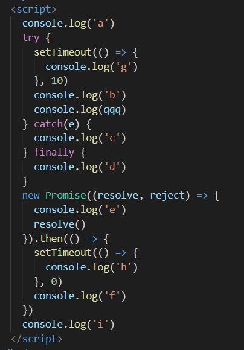

<!--
 * @Author: LiLangXiong680
 * @Date: 2021-03-06 20:33:24
 * @LastEditors: LiLangXiong680
 * @LastEditTime: 2021-03-10 16:18:05
 * @FilePath: /plan/interview/interview.md
-->

## 法大大

- 数组排序、去重

- typeof

- 假如让你设计个组件，下拉选择的options的样式怎么写

- form表单的model、rules、prop之间的关系 - 就是from怎么校验的吧



- 原生ajax

- 手写观察者模式

- 304状态码

- 用过那些设计模式

- promise


## 储备

9. 常见webpack-loader以及作用总结

    - raw-loader：加载文件原始内容（utf-8）
    - file-loader：把文件输出到一个文件夹中，在代码中通过相对URL去引用输出的文件
    - url-loader：和file-loader类似，但是能在文件很小的情况下，以base64的方式把文件内容注入到代码中
    - source-map-loader：加载额外的Source Map 文件，以方便调试
    - svg-inline-loader：将压缩后的SVG内容注入代码中
    - image-loader：加载并压缩图片文件
    - json-loader：加载JSON文件（默认包含）
    - handlebars-loader：将Handlebars模板编译成函数并返回
    - babel-loader：把ES6转为ES5
    - ts-loader：将Typescript转换为Javascript
    - awesome-typescript-loader：将Typescript转换成Javascript，性能优于ts-loader
    - css-loader：加载css，支持模块化、压缩、文件导入等特性
    - style-loader：把css代码注入到js中，通过DOM操作去加载css
    - eslint-loader：通过ESLint检查js代码
    - tslint-loader：通过TSLint检查Typescript代码
    - postcss-loader：扩展css语法，使用下一代css，可以配合autoprefixer插件自动补齐css3前缀
    - vue-loader：加载vue单文件组件
    - cashed-loader：可以在一些性能开销较大的Loader之前添加，目的是将结果缓存到磁盘中

10. vue计算属性和普通属性的区别

    computed属性是vue计算属性，是数据层到视图层的数据转化映射，计算属性是基于它们的依赖进行缓存的，只有在相关依赖发生改变时，它们才会重新求值。也就是说，只要它的依赖没有发生变化，那么每次访问的时候计算属性都会立即返回之前的计算结果，不再执行函数。
      - computed是响应式的，methods并非响应式。
      - 调用方式不一样，computed的定义成员像属性一样调用，methods定义的成员必须以函数形式调用。
      - computed是带缓存的，只有依赖数据发生改变，才会重新计算，而methods里面的函数在每次调用时都会执行。
      - computed中的成员可以只定义一个函数作为只读属性，也可以定义get/set变成可读可写属性，这点methods是做不到的。
      - computed不支持异步，当computed内有异步操作时无效，无法监听数据的变化。
    
    如果声明的计算属性计算量非常大的时候，而且访问量非常多，改变的时机却非常小，那就需要用到computed，缓存会让我们减少很多计算量。

11. webapck中source-map是什么？生产环境怎么使用？
  
    - source-map是将编译、打包、压缩后的代码映射回源代码的过程。打包之后的源代码不具备良好的可读性，想要调试源代码就需要source-map。
    - 只要不打开开发者工具，浏览器是不会加载source-map的。
    - 生产环境一般有三种处理方式：
      - hidden-source-map，借助第三方错误监控平台sentry使用。
      - nosources-source-map，只会显示具体行数以及查看源代码的错误栈，安全性能比source-map高。
      - source，通过nginx设置，将.map文件只对白名单开放。

12. 浏览器强缓存机制？
    - 浏览器缓存分为两种：
      - 强缓存
      - 协商缓存
    - 强缓存分为两种：
      - 需要发送http
      - 不需要发送http
    - 首先检查强缓存，这个阶段不需要发送http请求，如何检查呢？
      - 通过相应的字段来进行，在http1.0、http1.1中这个字段是不一样的。http1.0时代，使用的是Expires。http2.0时代，使用的是Cache-Control
        - Expires
          > Expires即过期时间，存在于服务器返回的响应头中，告诉浏览器在这个过期时间之前，可以直接从浏览器缓存中获取数据，无需发起请求。
          
          > Expires: Wed, 22 Nov 2020 08:30:00 GMT

          > 表示资源在2020年11月22号8点30分过期，过期了就得向服务器发起请求。

          > 缺点：如果服务器端时间与浏览器端时间不一致，那么服务器端返回的过期时间就有可能是不正确的，居于这个原因Expires 在Http1.1时被抛弃。

        - Cache-Control
          >它与Expires的本质区别是：它并没有采用具体过期时间点这种方式。而是采用过期时长来控制缓存，对应的字段是 max-age。

          > Cache-Control的优先级高于Expires。

          > Cache-Control：max-age=3600

          > 表示这个响应返回后在3600秒内，即一小时内可以直接使用缓存。

          > max-age可以组合非常多的指令，完成更多场景的缓存判断：
          - public：客户端和代理服务器器都可以缓存。因为一个请求可能要经过不同的代理服务器才能到达目标服务器，那么结果就是不仅仅浏览器可以缓存数据，中间的任何代理节点都可以缓存数据。
          - private：只有浏览器可以缓存数据，其他代理节点不能缓存。
          - no-cache：跳过当前的强缓存，发送http请求，即直接进入协商缓存阶段。
          - no-store：非常简单粗暴，不做任何形式的缓存。
          - s-maxage: 针对代理服务器的缓存时间。

13. Javascript全部数据类型

    - 内置类型
      - null 空值
      - undefined 为定义
      - boolean 布尔
      - number 数字
      - string 字符串
      - object 对象
      - symbol 符号
      - bigint 长整型
    
    - 基本数据类型
      - null 空值
      - undefined 为定义
      - boolean 布尔
      - number 数字
      - string 字符串
      - symbol 符号

    - 基本数据类型特点
      - 是按值访问的
      - 值是不可变的
      - 不可添加属性和方法
      - 赋值是简单的值赋值
      - 比较是值的比较
      - 是存放在栈区的

    - 引用数据类型
      - object 对象
      - array 数组
      - function 函数
      - date 时间

    - 引用数据类型特点
      - 值是可变的
      - 可以添加属性和方法
      - 赋值是引用赋值
      - 比较是引用的比较
      - 同时存放在栈区和堆区

    - 基本数据类型与引用数据类型的区别？
      
      1. 声明变量时不同的内存分配
          > 原始值：存储在栈(stack)中的简单数据段，也就是说，它们的值直接存储在变量访问的位置。是因为这些原始值占据的空间是固定的，所以可以将它们存储在较小的内存区域--栈中，这样存储便于快速查找变量的值。

          > 引用值：存储在堆(heap)中的对象，也就是说，存储在变量中的是一个指针(point)，指向存储对象的内存地址。是因为引用值的大小会改变，所以不能将它放在栈中，否则会降低变量查询的速度。相反，放在变量的栈空间中的值是该对象存储在堆中的地址。地址大小是固定的，所以把它存在栈中对变量性能无任何负面影响。

      2. 不同的内存分配机制也导致了不同的访问机制
          > 在js中是不允许直接访问保存在堆区的对象的，所以在访问一个对象时，首先得到的是这个对象在堆内存中的地址，然后再按照这个地址去获取这个对象中的值，这就是传说中的按引用访问。而原始类型的值是可以直接访问到的。

      3. 复制变量时的不同
          > 原始值：将一个保存着原始值的变量赋值给另一个变量时，会将原始值的副本赋值给新变量，此后两个变量是完全独立的，它们只是拥有相同的value而已。

          > 引用值：在将一个保存着对象内存地址的变量赋值给另一个变量时，会把这个内存地址赋值给新变量，也就是说这两个变量都指向了堆内存中同一个对象，它们中任何一个做出的改变都会反映在另一个身上。

      4. 参数传递不同
          > 首先应该明确一点是：ECMAScript中所有函数的参数都是**按值传递**的，但是为什么涉及到原始类型、引用类型时依然有区别呢？

          > 原因是内存分配时产生的差异。

          > 原始值：只是把变量里的值传递给参数，之后参数和这个变量互不影响。

          > 引用值：对象变量里的值是这个对象在堆内存中的内存地址，这一点很重要！因此它传递的值也就是这个内存地址，这也是为什么函数内部对这个参数的修改会体现在外部的原因，因为它们指向同一个对象。

  14. 能不能说在XSS攻击？
      > XSS攻击全称是 Cross Site Scripting【跨站脚本】，为了和CSS区分，所以叫它XSS。

      > XSS攻击是指浏览器中执行恶意脚本（无论是跨域还是同域），从而拿到用户信息进行操作。这些操作一般可以完成下面这些事情：
        - 窃取cookie
        - 监听用户行为，例如输入账号密码之后直接发送到黑客服务器
        - 修改DOM伪造登录表单
        - 在页面中生成浮窗广告

      > 通常情况下，XSS攻击的实现有三种方式
        - 存储型
        - 反射型
        - 文档型

      **存储型**
      > 将恶意脚本存储起来，确实，存储型的XSS脚本存储到了服务器端的数据库，然后在客户端执行这些脚本，从而达到攻击的效果。   

      > 常见的场景是留言评论区提交一段代码，如果前后端没有做好转义的工作，那评论内容存到了数据库，在页面渲染过程中直接执行，相当于执行一段位置逻辑的js代码，是非常恐怖的。

      **反射型**
      > 反射型XSS指的是恶意脚本作为网络请求的一部分，比如输入
      ```javascript
        https://www.xxxx.com?p=<script>alert('玩球了')</script>
      ```
      > 这样服务端会拿到p参数，然后将内容返回给浏览器端，浏览器将这些内容作为html的一部分解析，发现是一个脚本，直接执行，这样就被攻击了。

      > 之所以叫它反射型，是因为恶意脚本是通过作为网络请求的参数，经过服务器，然后反射到html文档中，执行解析。和存储型不一样的是：服务器并不会存储这些恶意脚本。

      **文档型**
      > 文档型的XSS攻击并不会经过服务端，而是作为中间人的角色，在数据传输过程劫持网路数据包，然后修改里面的html文档，这样的劫持方式包括 `Wi-Fi路由劫持`和`本地恶意软件`。

      **防范措施**
      > 三种攻击类型有一个共同点：都是让恶意脚本直接能在浏览器中执行，那么防范它，就是要避免这些脚本代码的执行，为了完成这一点，必须做到一个信念、两个利用。
        - 一个信念
          > 千万不要相信任何用户的输入！无论是在前端和服务端，都要对用户的输入进行转码或过滤。
          ```javascript
          // 转码前
          <script>alert('玩球了')</script>
          // 转码后
          &lt;script&gt;alert(&#39;玩球了&#39;)&lt;/script&gt;
          ```
        - 利用CSP
          > CSP，即浏览器中的内容安全策略，它的核心思想就是服务器决定浏览器加载哪些资源，具体来说可以完成以下功能：
            - 限制其他域下的资源加载
            - 禁止向其他域提交数据
            - 提供上报机制，能帮助我们即使发现XSS攻击
        - 利用HttpOnly
          > 很多XSS攻击脚本都是用来窃取Cookie，而设置Cookie的HttpOnly属性后，Javascript便无法读取Cookie的值，这样也很好的防范了XSS攻击
      
