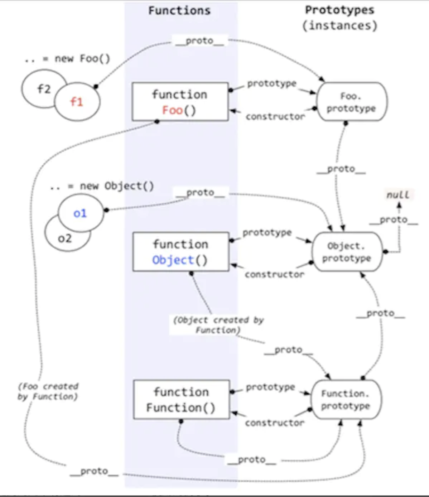

## typeof 原理

`typeof` 一般被用于判断一个变量的类型，我们可以利用 `typeof` 来判断`number,  string,  object,  boolean,  function, undefined,  symbol` 这七种类型，这种判断能帮助我们搞定一些问题，比如在判断不是 object 类型的数据的时候，`typeof`能比较清楚的告诉我们具体是哪一类的类型。但是，很遗憾的一点是，`typeof` 在判断一个 object的数据的时候只能告诉我们这个数据是 object, 而不能细致的具体到是哪一种 object, 比如

```js
let s = new String('abc');
typeof s === 'object'// true
s instanceof String // true
```

js 在底层存储变量的时候，会在变量的机器码的低位1-3位存储其类型信息。

- 000：对象
- 010：浮点数
- 100：字符串
- 110：布尔
- 1：整数

但是, 对于 `undefined` 和 `null` 来说，这两个值的信息存储是有点特殊的。

`null`：所有机器码均为0

`undefined`：用 −2^30 整数来表示

所以，`typeof` 在判断 `null` 的时候就出现问题了，由于 `null` 的所有机器码均为0，因此直接被当做了对象来看待。

因此在用 `typeof` 来判断变量类型的时候，我们需要注意，最好是用 `typeof `来判断基本数据类型（包括`symbol`），避免对 `null` 的判断。


## instanceof原理

`instanceof` 主要的作用就是判断一个实例是否属于某种类型，其原理的实现类似如下：

```js
function new_instance_of(leftVaule, rightVaule) { 
    let rightProto = rightVaule.prototype; // 取右表达式的 prototype 值
    leftVaule = leftVaule.__proto__; // 取左表达式的__proto__值
    while (true) {
    	if (leftVaule === null) {
            return false;	
        }
        if (leftVaule === rightProto) {
            return true;	
        } 
        leftVaule = leftVaule.__proto__ 
    }
}
```

其实 `instanceof` 主要的实现原理就是只要右边变量的 `prototype` 在左边变量的原型链上即可。因此，`instanceof` 在查找的过程中会遍历左边变量的原型链，直到找到右边变量的 `prototype`，如果查找失败，则会返回 `false`，告诉我们左边变量并非是右边变量的实例。

```js
function Foo() {
}

Object instanceof Object // true
Function instanceof Function // true
Function instanceof Object // true
Foo instanceof Foo // false
Foo instanceof Object // true
Foo instanceof Function // true
```

要想全部理解 `instanceof` 的原理，除了我们刚刚提到的实现原理，我们还需要知道 `JavaScript` 的原型继承原理。



我们知道每个 `JavaScript` 对象均有一个隐式的 `__proto__` 原型属性，而显式的原型属性是 `prototype`，只有 `Object.prototype.__proto__` 属性在未修改的情况下为 `null` 值。根据图上的原理，我们来梳理上面提到的几个有趣的 `instanceof` 使用的例子。

- `Object instanceof Object`

  由图可知，`Object` 的 `prototype` 属性是 `Object.prototype`, 而由于 `Object` 本身是一个函数，由 `Function` 所创建，所以 `Object.__proto__` 的值是 `Function.prototype`，而 `Function.prototype` 的 `__proto__` 属性是 `Object.prototype`，所以我们可以判断出，`Object instanceof Object` 的结果是 `true` 。
  
  用代码简单的表示一下

  ```js
  leftValue = Object.__proto__ = Function.prototype;
  rightValue = Object.prototype;
  // 第一次判断
  leftValue != rightValue
  leftValue = Function.prototype.__proto__ = Object.prototype
  // 第二次判断
  leftValue === rightValue
  // 返回 true
  ```
  `Function instanceof Function` 和 `Function instanceof Object` 的运行过程与 `Object instanceof Object` 类似，故不再详说。

- `Foo instanceof Foo`

  `Foo` 函数的 `prototype` 属性是 `Foo.prototype`，而 `Foo` 的 `__proto__` 属性是 `Function.prototype`，由图可知，`Foo` 的原型链上并没有 `Foo.prototype` ，因此 `Foo instanceof Foo` 也就返回 `false`。

  我们用代码简单的表示一下

  ```js
  leftValue = Foo, rightValue = Foo
  leftValue = Foo.__proto = Function.prototype
  rightValue = Foo.prototype
  // 第一次判断
  leftValue != rightValue
  leftValue = Function.prototype.__proto__ = Object.prototype
  // 第二次判断
  leftValue != rightValue
  leftValue = Object.prototype = null
  // 第三次判断
  leftValue === null
  // 返回 false
  ```

- `Foo instanceof Object`

  ```js
  leftValue = Foo, rightValue = Object
  leftValue = Foo.__proto__ = Function.prototype
  rightValue = Object.prototype
  // 第一次判断
  leftValue != rightValue
  leftValue = Function.prototype.__proto__ = Object.prototype
  // 第二次判断
  leftValue === rightValue
  // 返回 true 
  ```

- `Foo instanceof Function`

  ```js
  leftValue = Foo, rightValue = Function
  leftValue = Foo.__proto__ = Function.prototype
  rightValue = Function.prototype
  // 第一次判断
  leftValue === rightValue
  // 返回 true 
  ```

## 总结

简单来说，我们使用 `typeof` 来判断基本数据类型是 ok 的，不过需要注意当用 `typeof` 来判断 `null` 类型时的问题，如果想要判断一个对象的具体类型可以考虑用 `instanceof`，但是 `instanceof` 也可能判断不准确，比如一个数组，他可以被 `instanceof` 判断为 `Object`。所以我们要想比较准确的判断对象实例的类型时，可以采取 `Object.prototype.toString.call` 方法。
