## 从输入url到显示页面的另一个视角

在继续阅读之前，我们需要先大概了解一下浏览器的架构。

2007年之前，浏览器还是**单进程架构**，所有的模块都运行在**同一个进程**中。页面渲染、展示、js运行环境、插件都在页面线程中。

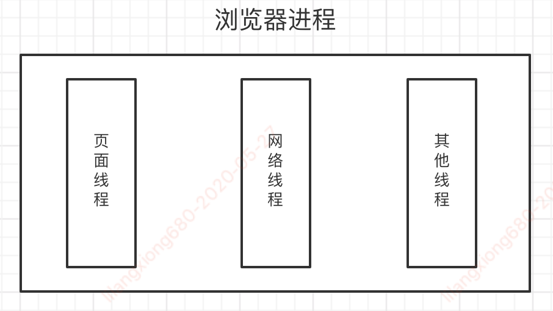

这个时期的浏览器在**安全、稳定、流畅**方面都存在问题。为了解决单进程架构带来的这些问题，Chrome团队在2008年发布了**多进程架构**的浏览器。

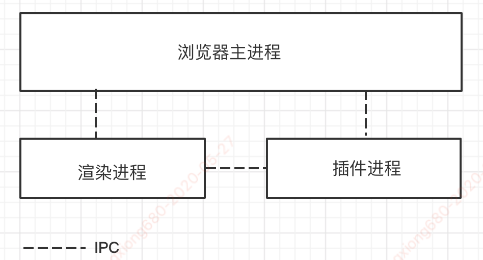

上图是早期的多进程架构。

早期多进程架构浏览器的分工：
  1、浏览器主进程负责网络资源加载、IPC的管理、展示页面。
  2、渲染进程负责页面解析、页面渲染、页面合成、js执行。
  3、插件进程负责浏览器插件的运行。

多进程架构也为引入**沙箱**机制提供了可能，其中渲染进程就是被隔离在沙箱中运行的。这样能够限制js对操作系统资源的操作权限。

Chrome架构演进的步伐一直没有停下来，下图是现在的Chrome架构。

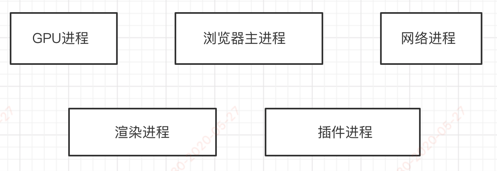

浏览器主进程中部分功能被剥离到一个单独的进程中。
  1、网络进程：负责网络资源的加载。
  2、GPU进程：3D CSS的实现 以及 UI界面的绘制。

**了解完Chrome的架构，我们以浏览器的视角来看看从输入url到显示页面这个过程都发生了什么?**

**第一步，肯定是用户输入**

当用户按下回车键之后，浏览器会判断输入的是请求url，还是搜索内容。

如果输入的是搜索内容，搜索引擎会将搜索内容作为关键字与搜索url拼接，产生新的url，并自动回填到地址栏，然后发起请求。

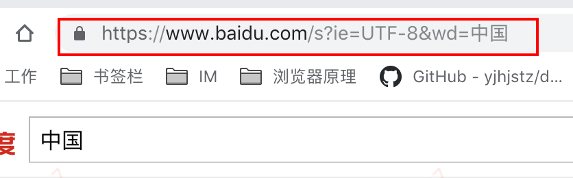

如果是请求url，则直接发起请求。

从上图可以看出，发起请求之后，tab栏上会出现加载状态，但是我们并没有立即看到新的页面，在浏览器视图中的仍是之前打开的页面。

**第二步，网络资源的请求**

浏览器主进程将url发送给网络进程，在网络进程中会发起真正的网络请求。

在这里有几个问题：**怎样识别目标主机并将数据送达？数据到达目标主机之后又是如何被准确分发到指定应用程序的？直接使用url就能将数据送达目标主机吗？**

**怎样识别目标主机并将数据送达？**

我们可以想象日常生活中，我们是如何打电话的？每台电话都有一个唯一的号码，我们可以通过这个号码来识别对方。同样的，在互联网中，每台在线的主机都有一个唯一的识别符，即IP地址。这里可以引申出互联网最底层的一个协议标准：**网际协议（Internet Protocol，简称IP）**。有兴趣的可以去深入了解。

在互联网通信中，信息是通过**数据包**的形式传递的。传输内容会被拆分为一个个数据包来传输，并非一次性将内容传输到目标主机。从A主机向B主机发送数据包时，为了能让A、B主机能够识别双方，完成双向数据传递，会在数据包上增加**IP头信息，IP头信息包括：IP版本、通信双方的IP地址、生存时间**。

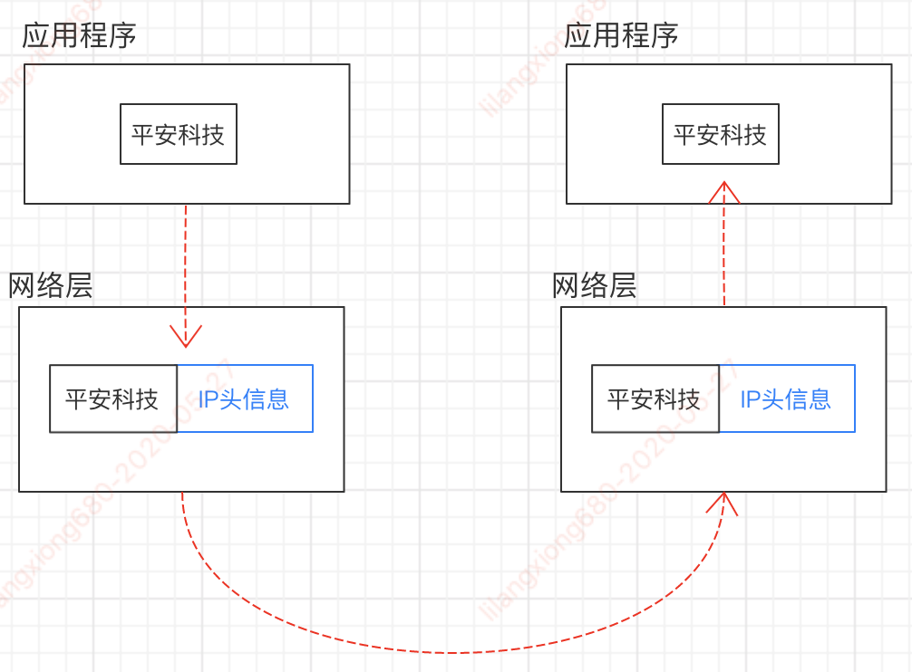

**数据到达目标主机之后又是如何被准确分发到指定应用程序的？**

网际协议只是解决了数据如何传输到目标主机的问题，但是数据到达目标主机之后，计算机又应该把数据分发给哪一个应用程序呢？是应该给微信呢？还是应该给QQ？

这个时候我们就需要一个基于网际协议之上，能够跟应用程序打交道的另一个协议标准：**TCP - 传输控制协议（Transmission Control Protocol）**。

**TCP 是面向连接的，可靠的，基于字节流的传输层协议**。面向连接是指TCP在传输数据包之前，需要先与目标主机建立通信连接，做好数据传输前的准备工作。另外相对比UDP协议，TCP协议提供了**数据校验机制、重传机制、数据包排序**，能够提供可靠的数据传输。

TCP中还有一个很重要、很重要的信息，就是**端口号**。任何想参与互联网通信的应用程序都必须绑定一个有效的端口号(**默认是80端口**)。换句话说，我们可以根据端口号来确定将数据分发给哪个应用程序。数据包在传输层，会被附加上TCP头信息: 通信双方的端口号、数据包序列号。

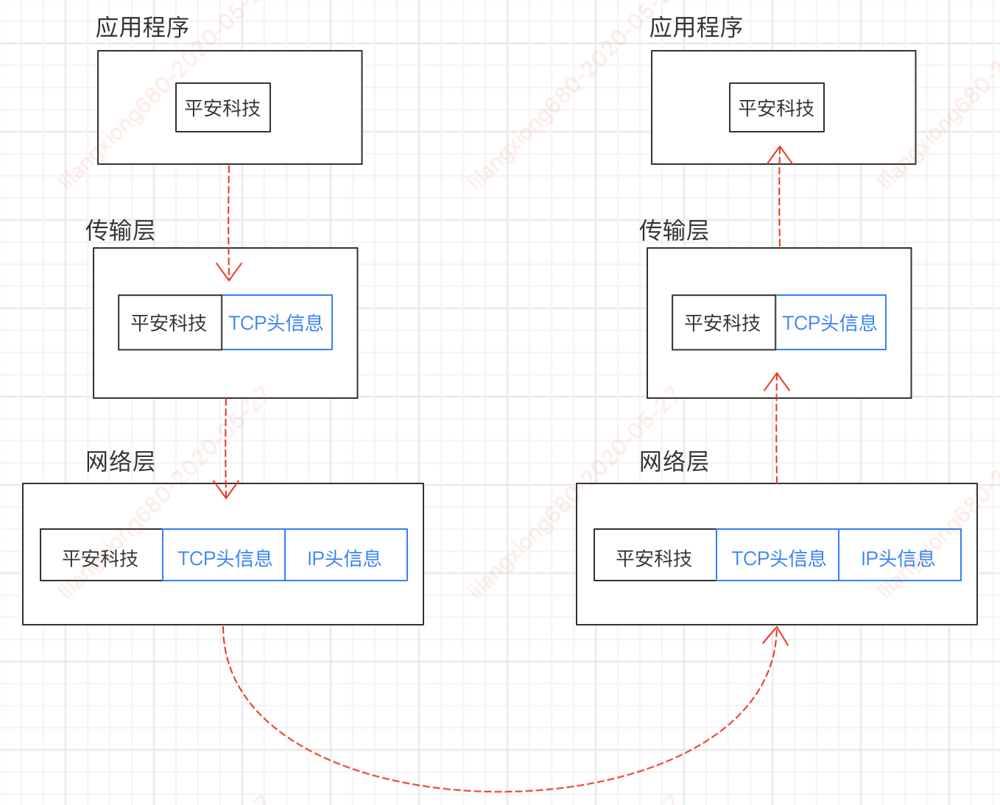

**直接使用url就能将数据送达目标主机吗？**

通过上面介绍我们知道计算机之间的通信是基于**网际协议、TCP协议的**，直接的url（也叫做域名）是无法识别主机、完成数据分发的。事实上域名只是方便人类记忆某个站点的地址而出现的。那么如何计算机又是如何完成域名到IP地址的转换的呢？

为了解决上述问题，又产生了一个服务：**域名系统，简称DNS（Domain Name System）**，域名系统保存着域名与IP地址的映射关系。网络进程发起请求之前会先请求DNS，获取到域名对应的IP地址。然后才向真实的目标主机发起请求。

解决完这三个问题，我们的思路回到第二步。

网络进程在发起请求前，会先检测浏览器是否已经有有效的本地缓存，如果有有效的本地缓存，就直接返回缓存。如果没有就发起网络请求，首先是进行DNS解析，获取到IP地址。然后通过IP与目标主机建立TCP连接。连接完成后，构造请求行、请求头、请求体，以数据包形式发送到目标主机。

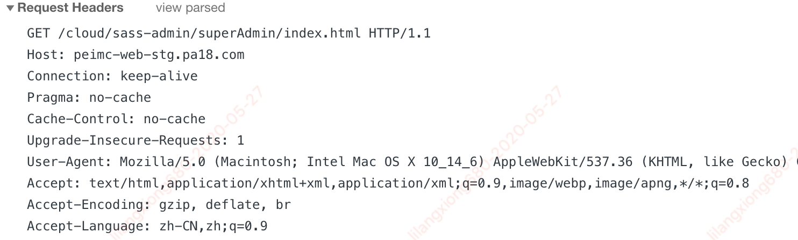

目标主机收到请求之后，构造响应行、响应头、响应体，返回给请求主机。网络进程收到响应行、响应头之后就会开始解析响应。

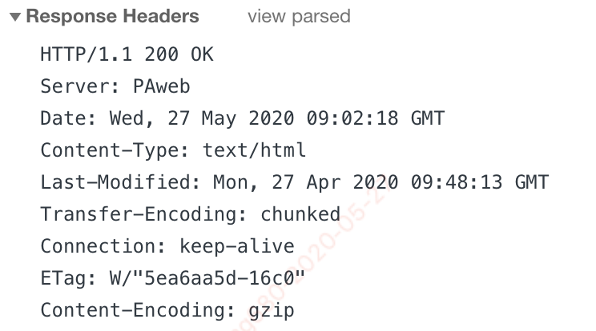

如果在响应行的状态码是**301或者302**，网络进程会获取响应头的**Location**中的**重定向**地址，重新发起请求。

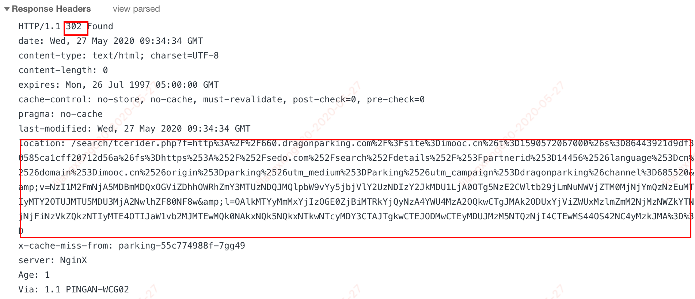

如果响应行的状态码是200， 网络进程则会继续往下处理数据，并通过响应头的**Content-Type**来判断目标主机返回的数据类型。

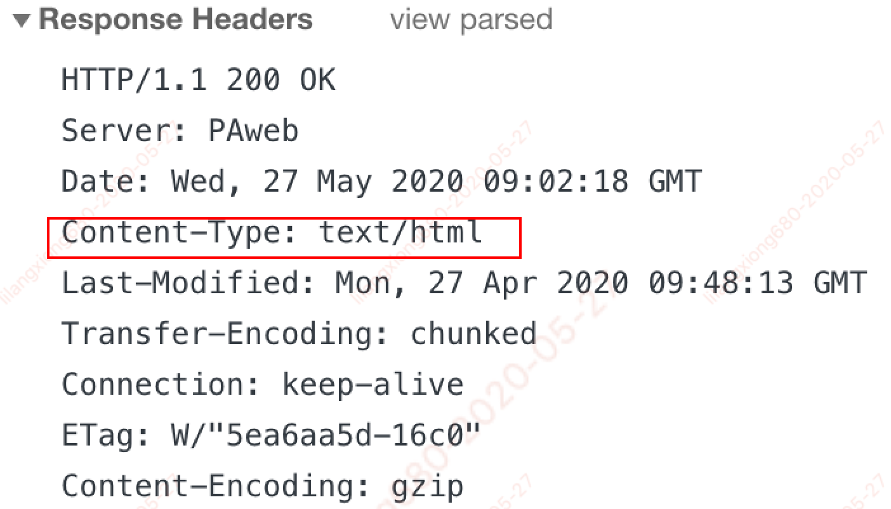

如果浏览器识别到Content-Type是个下载类型（octet-stream），就会终止处理，并将请求提交给浏览器的下载器，由下载器接管。

假定是text/html类型，网络进程会通知**浏览器主进程开始准备渲染进程**，前文已经介绍过，在Chrome浏览器中，页面的渲染是由渲染进程完成的。

渲染进程准备好之后，由于此时响应体数据存放在网络进程中，所以渲染进程还需要等待**网络进程提交响应体数据**。

渲染进程接收到浏览器主进程发送的"**提交文档**"通知后，渲染进程、网络进程之间会建立一个管道，用来接收响应体数据。接收完渲染进程会提交一个信号"**确认提交**"给浏览器主进程。

浏览器主进程一旦接收到"**确认提交**"信号，就会更新页面相关状态：停止tab标签的loading、修改前进后退按钮、替换视图中的页面等等

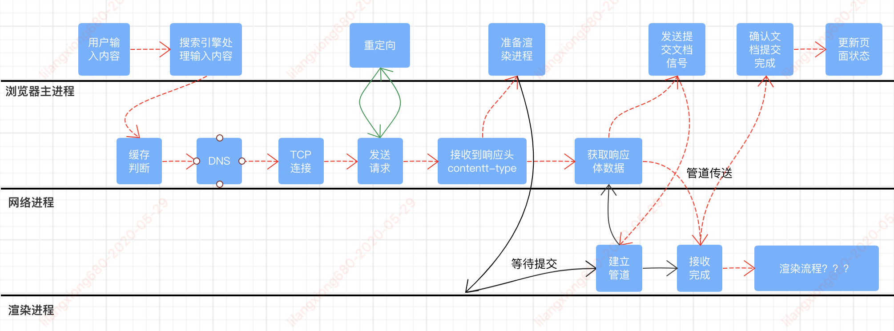

**第三步，渲染**

渲染进程接收到响应体数据之后，还需要经过一系列的处理过程，才能将Javascript、Html、Css绘制成页面。而且这些工作过程都由相同的特征：输入内容、处理内容、输出内容。那么接下来我们看看渲染进程是如何完成这些工作的?

**DOM树**

首先需要将Html转换成DOM树。浏览器是无法直接识别、使用Html的，需要使用 HTML 解析器将Html转换成树形结构。DOM结构跟Html内容看似一致，不过DOM结构是存放在内存中的，可以通过js增删改查DOM结构。

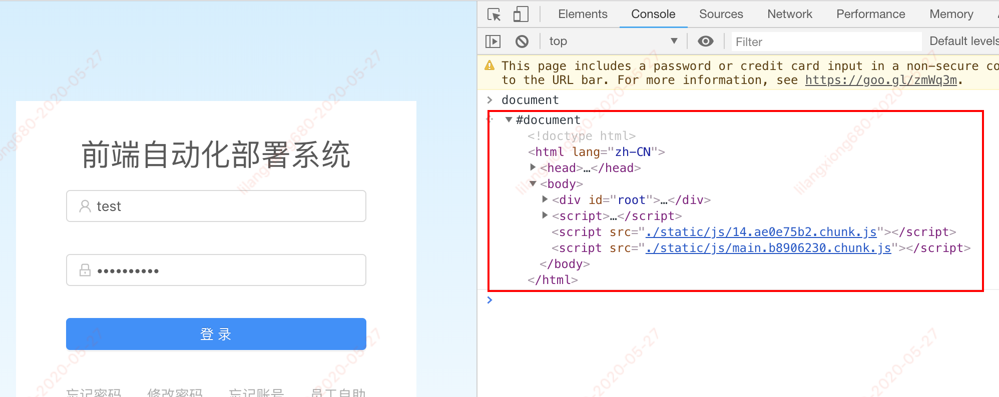

完成DOM树的构建之后，渲染引擎开始计算DOM节点的样式。

同样浏览器也是无法直接识别、使用css的。需要先**将css转换成styleSheets**。

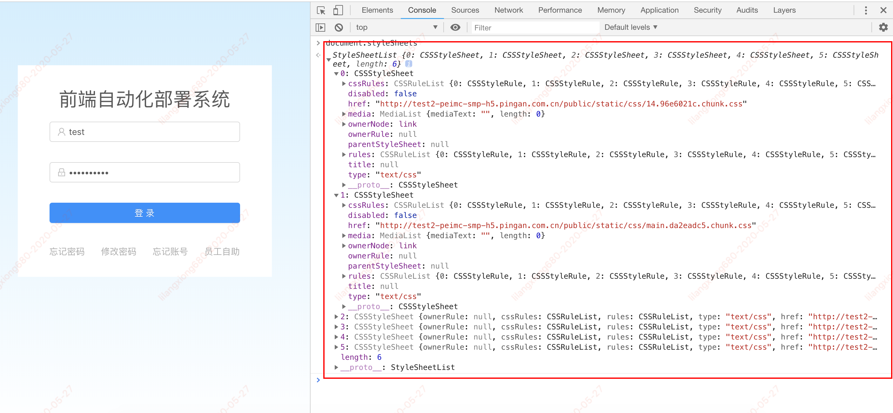

转换成styleSheets之后还需要继续将**css的属性值标准化**，转换成渲染引擎能够理解、标准化的值。如下所示：

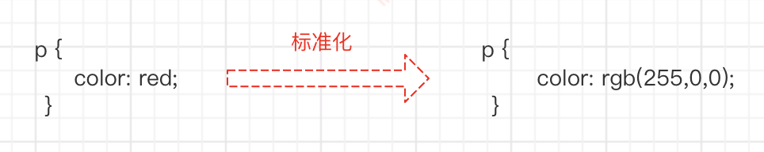

完成标准化之后，**根据继承、层叠规则计算每一个节点的具体样式**。对于没有设定样式的元素，则会使用浏览器提供的默认样式：UserAgent。最终的元素样式可通过computedStyle来查看。

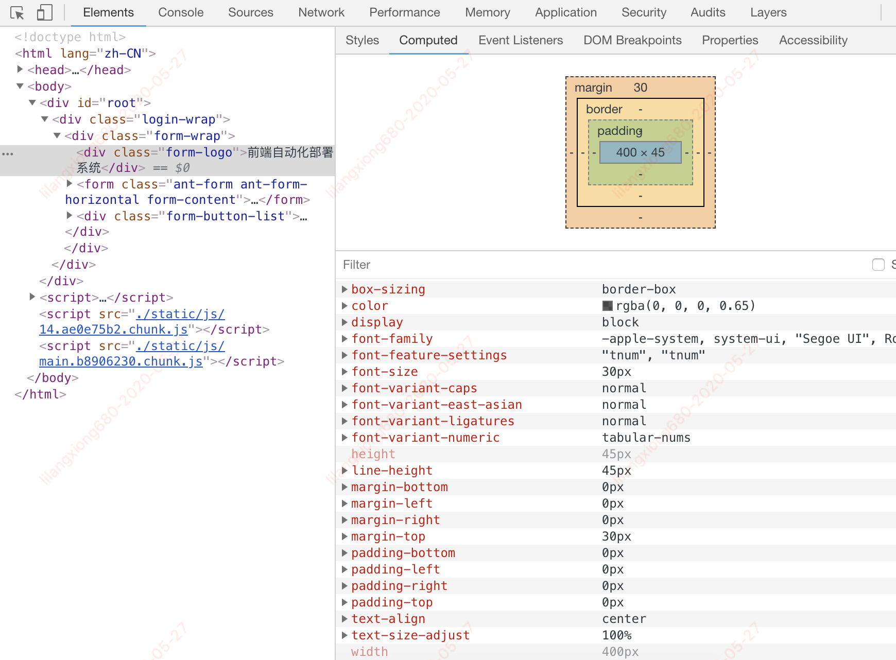

**LayoutTree**

有了DOM树、DOM节点的样式，渲染引擎还需要计算出每个可见的DOM节点的几何位置。这个过程我们也称之为：布局。它有两个步骤：

- 生成LayoutTree
- 布局计算。

**生成LayoutTree，即生成布局树**。在DOM树结构中，很多不需要展示的节点，例如document、head、style、script以及display:none的元素。生成布局树时会将这些不可见元素剔除，即布局树是由可见元素组成的树形结构。

**布局计算**。布局树生成后，渲染引擎就会计算布局树中每个节点的坐标位置，并将这些位置信息保存到布局树中。

**LayerTree**

Chrome为了很方便的实现一些复杂的功能，诸如：CSS3 3D 转换、页面滚动、z轴排序，借鉴了PhotoShop中的"图层"的概念。**渲染引擎会根据布局树，最终生成一个LayerTree（图层树）**。有[层叠属性](https://developer.mozilla.org/zh-CN/docs/Web/Guide/CSS/Understanding_z_index/The_stacking_context)（position、z-index、opacity、filter...）的元素、内容超出限定范围需要裁剪（clip）的元素、滚动条都会被单独提升为一个图层。其他元素一般都是附着在父图层上。

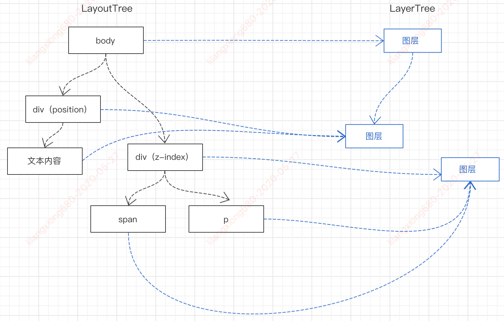

可以通过Chrome 的“开发者工具”中的layers来查看页面的图层。

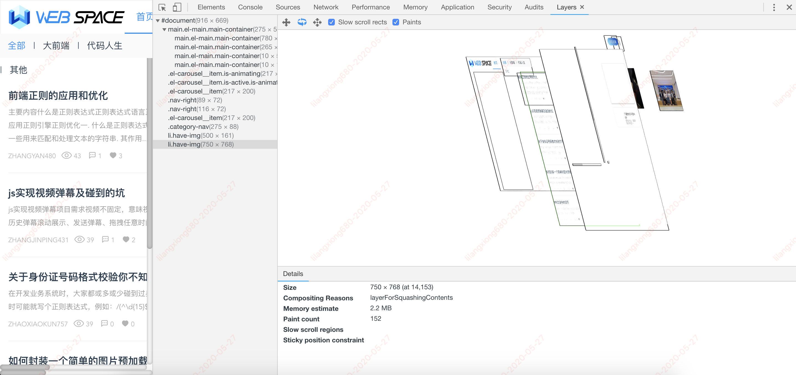

**图层绘制**

在完成一件事情时，我们都会将事情划分为一个个小步骤，然后才是按照步骤去完成它。同样的，渲染引擎在绘制图层时，也会划分步骤，这些步骤就叫做"**绘制指令**"
,并且会按照顺序把指令组成**绘制列表**。**随后渲染进程的主线程将绘制列表提交给合成线程**。

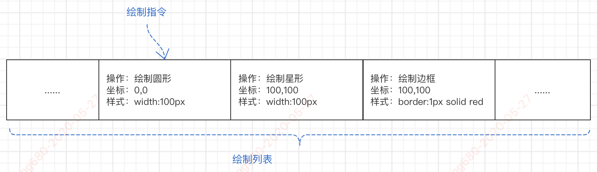

图层一般都很大、很长，对于窄小的视口而言，图层不可能在视口中完全展示，需要用户通过滚动来查看整个图层。为了提升渲染性能，没有必要一次性绘制完整个图层的内容。合成线程会将图层切割成一个个小的**图块(tile)**。

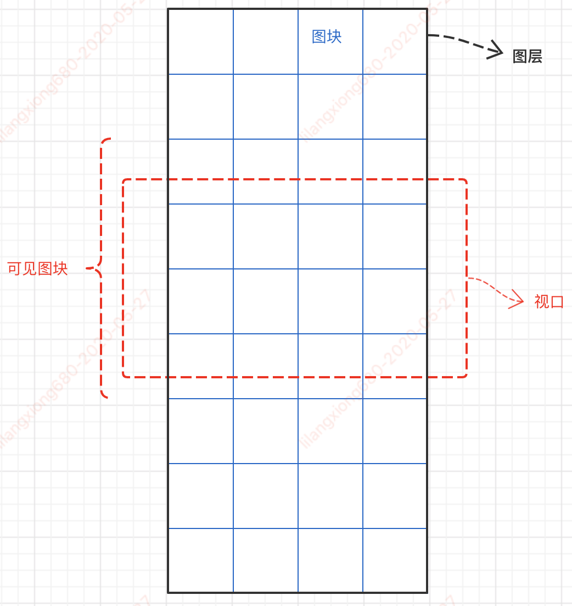

合成线程划分好（优先准备视口附近的图块）图块之后，会通知渲染进程维护的删格化线程池中的**删格化线程**将图块转为**位图**。**图块转为位图的过程也叫删格化**。

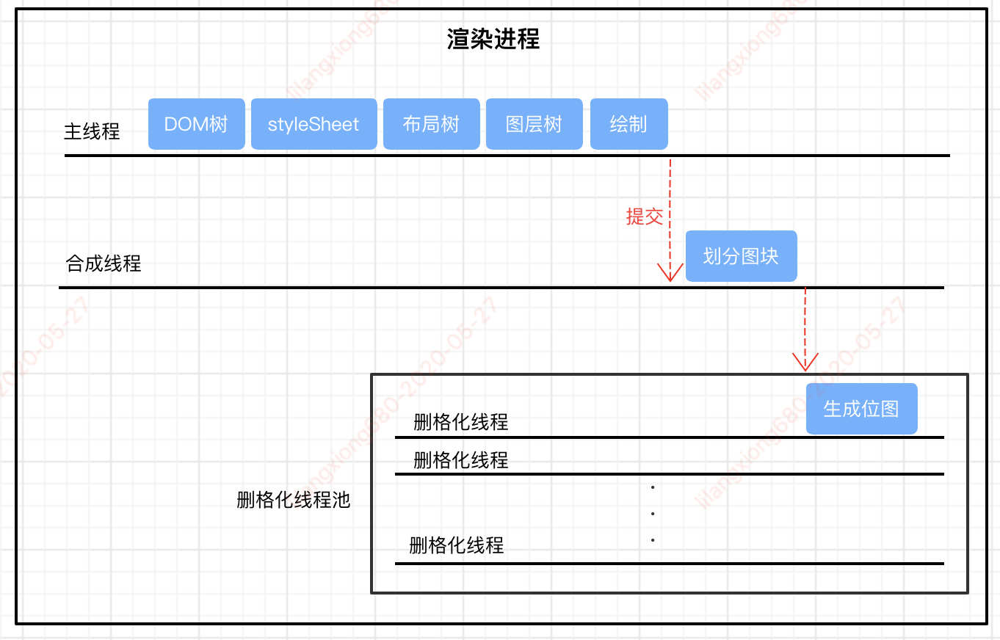

多数情况下，浏览器都会使用GPU来加速位图的生成，上文提到过GPU的操作是在**GPU进程**中的，假设删格化使用了GPU，那么位图最终是保存在GPU内存中的。

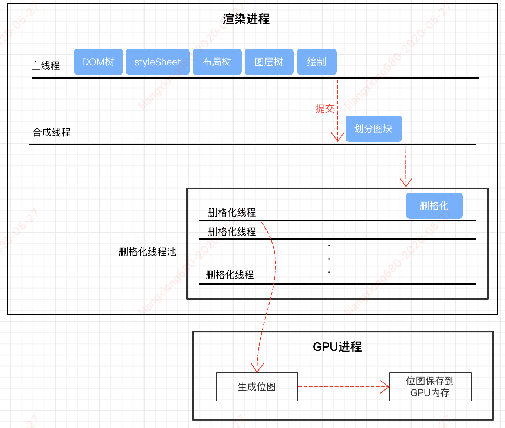

**合成、展示**

当所有的图层转为位图之后，即删格化完成之后，合成线程会给浏览器主进程一个**绘制图块**(**DrawQuad**)的命令。浏览接收到这个命令之后，浏览器进程的viz组件会根据命令，将内容绘制到内存中，并最终展示出来。

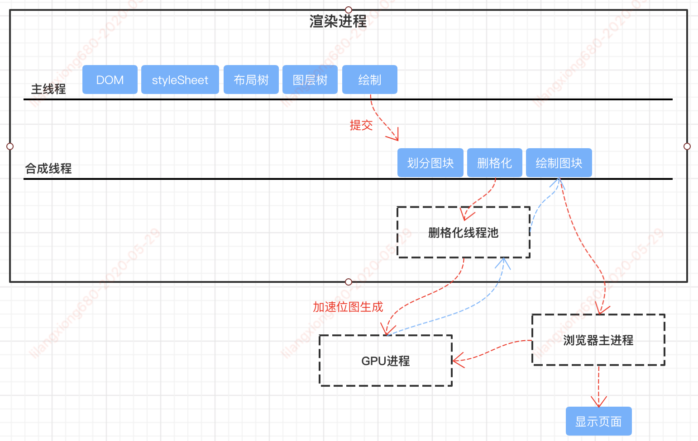

