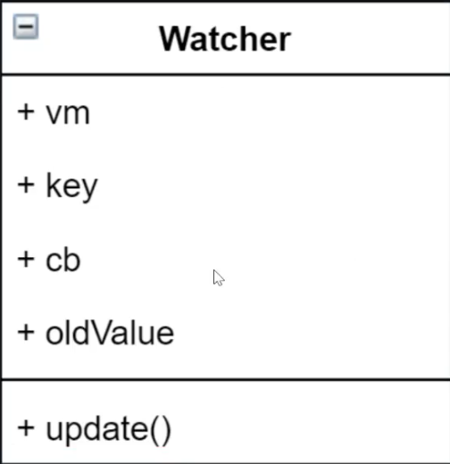

## 准备工作

- 数据驱动
- 响应式的核心原理
- 发布订阅模式和观察者模式

## 数据驱动
- 数据响应式、双向绑定、数据驱动
  - 数据响应式
    - 数据模型仅仅是普通的 JavaScript 对象，而当我们修改数据时，视图会进行更新，避免了繁琐的 DOM 操作，提高开发效率
  - 双向绑定
    - 数据改变，视图改变;视图改变，数据也随之改变
    - 我们可以使用 v-model 在表单元素上创建双向数据绑定
  - 数据驱动是 Vue 最独特的特性之一
    - 开发过程中仅需要关注数据本身，不需要关心数据是如何渲染到视图

## 数据响应式的核心原理

### Vue 2.x

- [Vue 2.x深入响应式原理](https://cn.vuejs.org/v2/guide/reactivity.html)

- [MDN - Object.defineProperty]()

- 由于defineProperty无法降级，浏览器兼容 IE8 以上(不兼容 IE8)。

```html
<!DOCTYPE html>
<html lang="cn">
  <head>
    <meta charset="UTF-8">
    <meta name="viewport" content="width=device-width, initial-scale=1.0">
    <title>defineProperty</title>
  </head>
  <body>
    <div id="app">msg</div>

    <script>
      // 模拟 Vue 中的 data 选项 
      let data = {
          msg: 'hello'
      }
      // 模拟 Vue 的实例
      let vm = {}

      // 数据劫持:当访问或者设置 vm 中的成员的时候，做一些干预操作
      Object.defineProperty(vm, 'msg', {
        // 可枚举(可遍历)
        enumerable: true,
        // 可配置(可以使用 delete 删除，可以通过 defineProperty 重新定义) 
        configurable: true,
        // 当获取值的时候执行
        get () {
            console.log('get: ', data.msg)
            return data.msg
        },
        // 当设置值的时候执行
        set (newValue) {
          console.log('set: ', newValue)
          if (newValue === data.msg) {
            return
          }
          data.msg = newValue
          // 数据更改，更新 DOM 的值
          document.querySelector('#app').textContent = data.msg
        }
      })
      // 测试
      vm.msg = 'Hello World'
      console.log(vm.msg)
    </script>
  </body>
</html>
```

### Vue 3.x

- [MDN - Proxy]()

- 直接监听对象，而非属性。

- ES6 中新增，IE 不支持，性能由浏览器优化。

```html
<!DOCTYPE html>
<html lang="cn">
  <head>
    <meta charset="UTF-8">
    <meta name="viewport" content="width=device-width, initial-scale=1.0">
    <title>defineProperty</title>
  </head>
  <body>
    <script>
      // 模拟 Vue 中的 data 选项
      let data = {
        msg: 'hello',
        count: 0 
      }
      // 模拟 Vue 实例
      // 直接劫持整个对象，无需遍历对象。性能也优于defineProperty。
      let vm = new Proxy(data, {
        // 当访问 vm 的成员会执行
        get (target, key) {
            console.log('get, key: ', key, target[key])
            return target[key]
        },
        // 当设置 vm 的成员会执行
        set (target, key, newValue) {
          console.log('set, key: ', key,newValue)
          if (target[key] === newValue) {
            return
          }
          target[key] = newValue
          document.querySelector('#app').textContent = target[key]
        } 
      })
      // 测试
      vm.msg = 'Hello World'
      console.log(vm.msg)
    </script>
  </body>
</html>
```

## 发布订阅模式和观察者模式

### 发布/订阅模式

- 发布/订阅模式

  - 订阅者

  - 发布者

  - 信号中心

  > 我们假定，存在一个"信号中心"，某个任务执行完成，就向信号中心"发布"(publish)一个信号，其他任务可以向信号中心"订阅"(subscribe)这个信号，从而知道什么时候自己可以开始执行。这就叫做"发布/订阅模式"(publish-subscribe pattern)。

- [Vue 的自定义事件](https://cn.vuejs.org/v2/guide/migration.html#dispatch-和-broadcast-替换)

```javascript
let vm = new Vue()

vm.$on('dataChange', () => {
  console.log('dataChange')
})

vm.$on('dataChange', () => {
  console.log('dataChange1')
})

vm.$emit('dataChange')
```

- 兄弟组件通信过程

```javascript
// eventBus.js
// 事件中心
let eventHub = new Vue()

// ComponentA.vue
// 发布者
addTodo: function () {
  // 发布消息(事件)
  eventHub.$emit('add-todo', { text: 'todo text' })
}

// ComponentB.vue
// 订阅者
created: function () {
  // 订阅消息(事件)
  eventHub.$on('add-todo', (data) => {
    console.log('text: ', data.text)
  })
}
```

- 模拟 Vue 自定义事件的实现

```javascript
class EventEmitter {
  constructor() {
    this.subs = Object.create(null) // {}，不需要Object的原型，可以提升性能
  }

  $on(eventType, handler) {
    this.subs[eventType] = this.subs[eventType] || []
    this.subs[eventType].push(handler)
  }

  $emit(eventType, data) {
    if (this.subs[eventType]) {
      this.subs[eventType].forEach(handler => handler(data))
    }
  }
}
```


### 观察者模式

- 观察者(订阅者) -- Watcher 
  - update():当事件发生时，具体要做的事情

- 目标(发布者) -- Dep
  - subs 数组:存储所有的观察者
  - addSub():添加观察者
  - notify():当事件发生，调用所有观察者的 update() 方法

- 没有事件中心，这是与发布订阅最大的区别

```html
<!DOCTYPE html>
<html lang="cn">
  <head>
    <meta charset="UTF-8">
    <meta name="viewport" content="width=device-width, initial-scale=1.0">
    <title>观察者模式</title>
  </head>
  <body>
    <script>
      // 发布者
      class Dep {
        constructor() {
          this.subs = []
        }

        // 添加观察者
        addSubs(watcher) {
          if (watcher && watcher.update) {
            this.subs.push(watcher)
          }
        }

        // 调用观察者的update
        notify() {
          this.subs.forEach(watcher => watcher.update())
        }
      }

      // 观察者
      class Watcher() {
        constructor() {}

        // update
        update() {
          console.log('notify ---> update')
        }
      }

      const dep = new Dep()
      const watcher = new Watcher()

      dep.addSubs(watcher)
      dep.notify()
    </script>
  </body>
</html>
```

## 总结

**观察者模式**是由具体目标调度，比如当事件触发，Dep 就会去调用观察者的方法，所以观察者模式的订阅者与发布者之间是存在依赖的。

**发布/订阅模式**由统一调度中心调用，因此发布者和订阅者不需要知道对方的存在。


## 响应式模拟

- Vue 基本结构与使用

```html
<!DOCTYPE html>
<html lang="cn">
  <head>
    <meta charset="UTF-8">
    <meta name="viewport" content="width=device-width, initial-scale=1.0">
    <title>Vue</title>
  </head>
  <body>
    <div id="app">
      <h1>差值表达式</h1>
      <h3>{{msg}}</h3>
      <h3>{{count}}</h3>

      <h1>v-text</h1>
      <h3 v-text="msg"></h3>
      
      <h1>v-model</h1>
      <input type="text" v-model="msg">
      <input type="text" v-model="count">
    </div>
    <script src="https://cdn.bootcdn.net/ajax/libs/vue/2.6.9/vue.common.dev.js"></script>
    <script>
      let vm = new Vue({
        el: '#app',
        data: {
          msg: 'Hello Vue',
          count: 20
        }
      })

      console.log(vm)
    </script>
  </body>
</html>
```

- 整体结构


- Vue
  - 把 data 中的成员注入到 Vue 实例，并且把 data 中的成员转成 getter/setter Observer
能够对数据对象的所有属性进行监听，如有变动可拿到最新值并通知 Dep 

- Compiler
  - 解析每个元素中的指令/插值表达式，并替换成相应的数据 
  
- Dep
  - 添加观察者(watcher)，当数据变化通知所有观察者
  
- Watcher
  - 数据变化更新视图

## Vue

- 功能
  - 接收初始化的参数(选项)
  - 把 data 中的属性注入到 Vue 实例，转换成 getter/setter
  - 调用 observer 监听 data 中所有属性的变化
  - 调用 compiler 解析指令/插值表达式

- 结构


```javascript
class Vue {
  constructor(options) {
    // 1. 通过属性保存选项的数据
    this.$options = options || {}
    this.$data = options.data || {}
    this.$el = typeof options.el === 'string' ? document.querySelector(options.el) : options.el
    // 2. 把data中的成员转换成getter和setter，注入到vue实例中
    this._proxyData(this.$data)
    // 3. 调用observer对象，监听数据的变化
    // 4. 调用compiler对象，解析指令和差值表达式
  }

  _proxyData(data) {
    Object.keys(data).forEach(key => {
      // 把data的属性注入到vue的实例中
      Object.defineProperty(this, key, {
        enumerable: true,
        configurable: true,
        get() {
          return data[key] // 即this.$data[key]
        },
        set(newValue) {
          if (newValue === data[key]) return
          data[key] = newValue // 即this.$data[key] = newValue
        }
      })
    })
  }
}
```

## Observer

- 功能
  - 负责把 data 选项中的属性转换成响应式数据
  - data 中的某个属性也是对象，把该属性转换成响应式数据
  - 数据变化发送通知
  
- 结构


```javascript
class Observer {
  constructor(data) {
    this.walk(data)
  }

  walk(data) {
    // 判断data是否是对象
    if (!data || typeof data !== 'object') return
    // 遍历data属性，转为响应式
    Object.keys(data).forEach(key => {
      this.defineReactive(data, key, data[key])
    })
  }

  defineReactive(data, key, val) {
    Object.defineProperty(data, key, {
      enumerable: true,
      configurable: true,
      get() {
        return val // 此处不能使用obj[key]，否则会引起死循环：vm.msg --> 触发vm.msg的get(_proxyData) --> data[msg](_proxyData) --> 触发this.$data.msg的get(defineReactive) --> data[msg] --> 触发this.$data.msg的get ......
      },
      set(newValue) {
        if (newValue === val) return
        val = newValue
        // 发送通知
      }
    })
  }
}
```

**defineReactive为何能使用val返回data[key]的值？**

是通过闭包的形式实现的。


```javascript
class Vue {
  constructor(options) {
    // 1. 通过属性保存选项的数据
    this.$options = options || {}
    this.$data = options.data || {}
    this.$el = typeof options.el === 'string' ? document.querySelector(options.el) : options.el
    // 2. 把data中的成员转换成getter和setter，注入到vue实例中
    this._proxyData(this.$data)
    // 3. 调用observer对象，监听数据的变化
    new Observer(this.$data)
    // 4. 调用compiler对象，解析指令和差值表达式
  }

  _proxyData(data) {
    Object.keys(data).forEach(key => {
      // 把data的属性注入到vue的实例中
      Object.defineProperty(this, key, {
        enumerable: true,
        configurable: true,
        get() {
          return data[key] // 即this.$data[key]
        },
        set(newValue) {
          if (newValue === data[key]) return
          data[key] = newValue // 即this.$data[key] = newValue
        }
      })
    })
  }
}
```

## Compiler

- 功能
  - 编译模板，解析指令/插值表达式
  - 页面的首次渲染
  - 当数据变化后重新渲染视图

- 结构


```javascript
class Compiler {
  constructor(vm) {
    this.el = vm.$el
    this.vm = vm
    // 编译模版
    this.compiler(this.el)
  }

  // 编译模版
  compiler(el) {
    const childNodes = el.childNodes
    Array.from(childNodes).forEach(node => {
      if (this.isTextNode(node)) {
        // 处理文本节点
        this.compilerText(node)
      } else if (this.isElementNode(node)) {
        // 处理元素节点
        this.compilerElement(node)
      }

      // 判断node节点是否有子节点，如果有，递归处理
      if (node.childNodes && node.childNodes.length) this.compiler(node)
    })
  }

  // 编译元素节点，处理指令
  compilerElement(node) {
    console.log(node.attributes)
    // 遍历所有的属性节点
    Array.from(node.attributes).forEach(attr => {
      // 判断是否是指令
      let attrName = attr.name
      if (this.isDirective(attrName)) {
        // v-text ---> text，使用策略模式
        attrName = attrName.substr(2)
        let key = attr.value
        this.update(node, key, attrName)
      }
    })
  }

  update(node, key, attrName) {
    let updateFn = this[`${attrName}Updater`]
    updateFn && updateFn(node, this.vm[key])
  }

  // 处理 v-text 指令
  textUpdater(node, value) {
    node.textContent = value
  }

  // 处理 v-model 指令
  modelUpdater(node, value) {
    node.value = value
  }

  // 编译文本节点，处理差值表达式{{ msg }}
  compilerText(node) {
    console.dir(node)
    let reg = /\{\{(.+?)\}\}/
    let value = node.textContent
    if (reg.test(value)) {
      let key = RegExp.$1.trim()
      node.textContent = value.replace(reg, this.vm[key])
    }
  }

  // 判断原属属性是否是指令
  isDirective(attrName) {
    return attrName.startsWith('v-')
  }

  // 判断节点是否是文本节点
  isTextNode(node) {
    return node.nodeType === 3
  }

  // 判断节点是否是元素节点
  isElementNode(node) {
    return node.nodeType === 1
  }
}
 
```

```javascript
class Vue {
  constructor(options) {
    // 1. 通过属性保存选项的数据
    this.$options = options || {}
    this.$data = options.data || {}
    this.$el = typeof options.el === 'string' ? document.querySelector(options.el) : options.el
    // 2. 把data中的成员转换成getter和setter，注入到vue实例中
    this._proxyData(this.$data)
    // 3. 调用observer对象，监听数据的变化
    new Observer(this.$data)
    // 4. 调用compiler对象，解析指令和差值表达式
    new Compiler(this)
  }

  _proxyData(data) {
    Object.keys(data).forEach(key => {
      // 把data的属性注入到vue的实例中
      Object.defineProperty(this, key, {
        enumerable: true,
        configurable: true,
        get() {
          return data[key] // 即this.$data[key]
        },
        set(newValue) {
          if (newValue === data[key]) return
          data[key] = newValue // 即this.$data[key] = newValue
        }
      })
    })
  }
}
```

##  Dep(Dependency)


- 功能
  - 收集依赖，添加观察者(watcher)
  - 通知所有观察者

- 结构


```javascript
// 发布者
class Dep {
  constructor() {
    this.subs = []
  }

  // 添加观察者
  addSubs(watcher) {
    if (watcher && watcher.update) {
      this.subs.push(watcher)
    }
  }

  // 调用观察者的update
  notify() {
    this.subs.forEach(watcher => watcher.update())
  }
}
```


```javascript
class Observer {
  constructor(data) {
    this.walk(data)
  }

  walk(data) {
    // 判断data是否是对象
    if (!data || typeof data !== 'object') return
    // 遍历data属性，转为响应式
    Object.keys(data).forEach(key => {
      this.defineReactive(data, key, data[key])
    })
  }

  defineReactive(data, key, val) {
    const self = this
    // 负责收集依赖，并发送通知
    const dep = new Dep()
    Object.defineProperty(data, key, {
      enumerable: true,
      configurable: true,
      get() {
        // 收集依赖
        Dep.target && dep.addSubs(Dep.target)
        return val // 此处不能使用obj[key]，否则会引起死循环：vm.msg --> 触发vm.msg的get(_proxyData) --> data[msg](_proxyData) --> 触发this.$data.msg的get(defineReactive) --> data[msg] --> 触发this.$data.msg的get ......
      },
      set(newValue) {
        if (newValue === val) return
        val = newValue
        self.walk(newValue)
        // 发送通知
        dep.notify()
      }
    })
  }
}
```

## Watcher


- 功能
  - 当数据变化触发依赖， dep 通知所有的 Watcher 实例更新视图
  - 自身实例化的时候往 dep 对象中添加自己

- 结构



```javascript
class Watcher {
  constructor(vm, key, cb) {
    this.vm = vm
    // data中的属性名称
    this.key = key
    // 回调函数负责更新视图
    this.cb = cb
    // 以下有严格的执行顺序

    // 把watcher对象挂载到Dep类的静态属性target
    Dep.target = this
    // 触发get方法，在get方法中会嗲用addSubs
    this.oldValue = vm[key]
    // 防止重复收集
    Dep.target = null
  }

  // 当数据更新的时候更新视图
  update() {
    let newValue = this.vm[this.key]
    if (this.oldValue === newValue) return
    this.cb(newValue)
  }
}
```

```javascript
class Compiler {
  constructor(vm) {
    this.el = vm.$el
    this.vm = vm
    // 编译模版
    this.compiler(this.el)
  }

  // 编译模版
  compiler(el) {
    const childNodes = el.childNodes
    Array.from(childNodes).forEach(node => {
      if (this.isTextNode(node)) {
        // 处理文本节点
        this.compilerText(node)
      } else if (this.isElementNode(node)) {
        // 处理元素节点
        this.compilerElement(node)
      }

      // 判断node节点是否有子节点，如果有，递归处理
      if (node.childNodes && node.childNodes.length) this.compiler(node)
    })
  }

  update(node, key, attrName) {
    let updateFn = this[`${attrName}Updater`]
    updateFn && updateFn.call(this, node, this.vm[key], key)
  }

  // 处理 v-text 指令
  textUpdater(node, value, key) {
    // 首次渲染时更新视图
    node.textContent = value

    // 创建watcher对象，当数据再次改变时更新视图
    new Watcher(this.vm, key, (newValue) => {
      node.textContent = newValue
    })
  }

  // 处理 v-model 指令
  modelUpdater(node, value, key) {
    // 首次渲染时更新视图
    node.value = value

    // 创建watcher对象，当数据再次改变时更新视图
    new Watcher(this.vm, key, (newValue) => {
      node.value = newValue
    })
  }

  // 编译元素节点，处理指令
  compilerElement(node) {
    // 遍历所有的属性节点
    Array.from(node.attributes).forEach(attr => {
      // 判断是否是指令
      let attrName = attr.name
      if (this.isDirective(attrName)) {
        // v-text ---> text，使用策略模式
        attrName = attrName.substr(2)
        let key = attr.value
        this.update(node, key, attrName)
      }
    })
  }

  // 编译文本节点，处理差值表达式{{ msg }}
  compilerText(node) {
    let reg = /\{\{(.+?)\}\}/
    let value = node.textContent
    if (reg.test(value)) {
      let key = RegExp.$1.trim()
      // 首次渲染时更新视图
      node.textContent = value.replace(reg, this.vm[key])

      // 创建watcher对象，当数据再次改变时更新视图
      new Watcher(this.vm, key, (newValue) => {
        node.textContent = newValue
      })
    }
  }

  // 判断原属属性是否是指令
  isDirective(attrName) {
    return attrName.startsWith('v-')
  }

  // 判断节点是否是文本节点
  isTextNode(node) {
    return node.nodeType === 3
  }

  // 判断节点是否是元素节点
  isElementNode(node) {
    return node.nodeType === 1
  }
}
```

## 总结

- 问题
  - 给 Vue 实例新增一个成员是否是响应式的? 
  - 给属性重新赋值成对象，是否是响应式的?

- 通过下图回顾整体流程


- Vue
  - 记录传入的选项，设置 $data/$el
  - 把 data 的成员注入到 Vue 实例
  - 负责调用 Observer 实现数据响应式处理(数据劫持)
  - 负责调用 Compiler 编译指令/插值表达式等
 
- Observer
  - 数据劫持
    - 负责把 data 中的成员转换成 getter/setter 
    - 负责把多层属性转换成 getter/setter
    - 如果给属性赋值为新对象，把新对象的成员设置为 getter/setter
  - 添加 Dep 和 Watcher 的依赖关系
  - 数据变化发送通知

- Compiler
  - 负责编译模板，解析指令/插值表达式
  - 负责页面的首次渲染过程
  - 当数据变化后重新渲染

- Dep
  - 收集依赖，添加订阅者(watcher)
  - 通知所有订阅者

- Watcher
  - 自身实例化的时候往dep对象中添加自己
  - 当数据变化dep通知所有的 Watcher 实例更新视图
