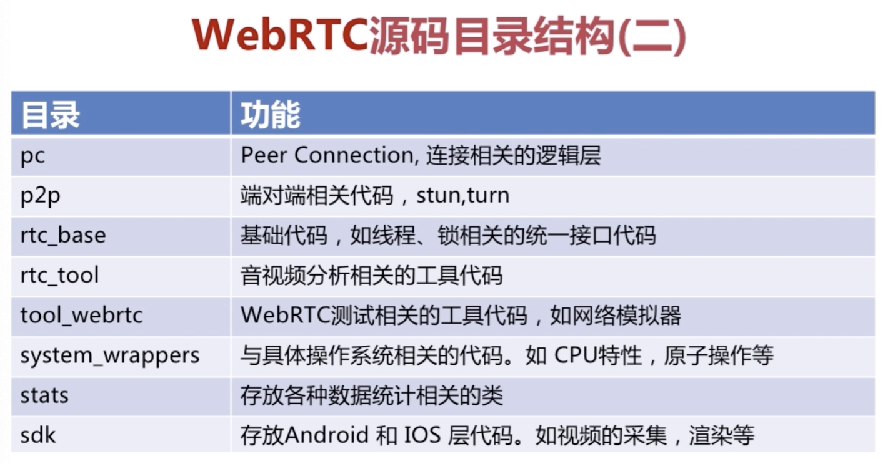

<!--
 * @Author: LiLangXiong680
 * @Date: 2021-01-18 20:19:10
 * @LastEditors: LiLangXiong680
 * @LastEditTime: 2021-01-31 21:44:52
 * @FilePath: /plan/webrtc/webrtc.md
-->

# 源码目录

## webRTC目录




## modules目录


# 轨与流

- 轨：Track，两条轨之间是不会相交的，音频轨、视频轨、字母轨就是相互独立的。

- 流：MediaStream，音频流、视频流。

# webRTC重要类

- MediaStream，

- RTCPeerConnection，最重要的一个类，涉及peer建立，打洞，turn服务

- RTCDataChannel，非音视频数据的传输，最终将数据交与RTCPeerConnection


## 完整的1v1直播

[webrtc](https://www.w3.org/TR/webrtc/#rtcconfiguration-dictionary)

### RTCPeerConnection类

基本格式：

```javascript
myPeerConnection = new RTCPeerConnection([configuration])
```

configuration 可选：

```javascript
dictionary RTCConfiguration {
  sequence<RTCIceServer> iceServers;
  RTCIceTransportPolicy iceTransportPolicy;
  RTCBundlePolicy bundlePolicy;
  RTCRtcpMuxPolicy rtcpMuxPolicy;
  sequence<RTCCertificate> certificates;
  [EnforceRange] octet iceCandidatePoolSize = 0;
};
```
- [iceServers详细介绍](https://www.w3.org/TR/webrtc/#rtciceserver-dictionary)

  由RTCIceServer组成。每个TRTIceServer都是一个ICE代理的服务

  |  属性   | 含义  |
  |  ----  | ----  |
  | credential  | 凭据，只有TURN服务使用 |
  | credentialType  | 凭据类型可以password或oauth |
  | urls  | 用于连接服务中的url数组 |
  | username  | 用户名，只有TURN服务使用 |


- [iceTransportPolicy详细介绍](https://www.w3.org/TR/webrtc/#rtcicetransportpolicy-enum)

  指定ICE传输策略：

  - relay：只使用中继候选者

  - all：可以使用任何类型的候选者

- [bundlePolicy详细介绍](https://www.w3.org/TR/webrtc/#rtcbundlepolicy-enum)

  |  属性   | 含义  |
  |  ----  | ----  |
  | Balanced  | 音频与视频轨使用各自的传输通道|
  | max-compat  | 每个轨使用自己的传输通道|
  | max-bundle  | 都绑定到同一个传输通道|


- [rtcpMuxPolicy详细介绍](https://www.w3.org/TR/webrtc/#rtcbundlepolicy-enum)

  该选项在收集ICE候选者时使用。

  |  属性   | 含义  |
  |  ----  | ----  |
  | negotiate  | 收集RTCP与RTP复用的ICE候选者，如果RTCP能复用就与RTP复用，如果不能复用，就将它们单独使用|
  | require  | 只能收集RTCP与RTP复用的ICE候选者，如果RTCP不能复用，则失败|

- [certificates详细介绍](https://www.w3.org/TR/webrtc/#dom-rtcconfiguration-certificates)

  授权可以使用的一组证书。

- [iceCandidatePoolSize详细介绍](https://www.w3.org/TR/webrtc/#dom-rtcconfiguration-certificates)

  16为的整数值，用于指定预取的ICE候选者个数。如果该值发生变化，它会触发重新收集候选者。

### RTCPeerConnection方法分类

- 媒体协商

- Stream/Track

- 传输相关方法

- 统计相关方法

### RTCPeerConnection方法

- [addIceCandidate详细介绍](https://www.w3.org/TR/webrtc/#dom-peerconnection-addicecandidate)

  **基本格式：**
  
  `aPromise = myPeerConnection.addIceCandidate(candidate)`

  **candidate**
  |  属性   | 含义  |
  |  ----  | ----  |
  | candidate  | 候选者描述信息|
  | sdpMid  | 与候选者相关的媒体流的识别标签|
  | sdpMLineIndex  | 在SDP中m=的索引值|
  | usernameFragment  | 包括了远端的唯一标识|

- [createOffer详细介绍](https://www.w3.org/TR/webrtc/#dom-rtcpeerconnection-createoffer)

  **基本格式：**

  `aPromise = myPeerConnection.createOffer([options])`

  **options 可选**
  |  属性   | 含义  |
  |  ----  | ----  |
  | iceRestart  | 该选项会重启ICE，重新进行Candidate收集。通过ice-ufrag以及ice-pwd是否发生变化来判断新的通道是否生效|
  | voiceActivityDetection  | 是否开启静音检测，默认开启|
  |  offerToReceiveAudio | 接收远端音频|
  |  offerToReceiveVideo | 接收远端视频|
  

 
### 媒体协商过程


- Amy首先createOffer，创建offer之后实际形成了一个SDP。
 
- Amy发送前先调用setLocalDescription方法，发送bind request到STUN/TURN服务器收集候选者-Candidate（本地IP、通过NAT之后反射的IP、TURN服务的中继 IP）。同时通过云端信令channel将offer传递给Bob。 

- Bob收到offer之后调用setRemoteDescription，将offer所形成的SDP信息放在远端的槽中。  

- Bob会createAnswer，形成了一个SDP。发送前先调用setLocalDescription方法，发送bind request到STUN/TURN服务器收集候选者-Candidate（本地IP、通过NAT之后反射的IP、TURN服务的中继 IP）。同时通过云端信令channel将answer传递给Amy。 

- Amy收到answer之后调用setRemoteDescription，将answer所形成的SDP信息放在远端的槽中。

最终在内部进行媒体协商，找出两者的关于音视频编解码、音视频类型、采样率等信息的交集。

1V1的场景下，各端最终都有两个SDP，一个本地的，一个远端的。


**have-local-offer、have-remote-offer**

 -各端初始化RTCConnection时，处于稳定状态：stable。此时connection已经可使用，由于还没有数据协商，所以还无法编解码、传输。

 - 创建offer，并setLocalDescription之后，状态变为：have-local-offer。

 - 接收到远端的answer，并setRemoteDescription之后，状态变为：stable。此时connection可用，并能编解码、传输。

 - 远端接收到offer，并setRemoteDescription之后，状态变为：have-remote-offer。此时connection已经可使用，由于还没有数据协商，所以还无法编解码、传输。

 - 远端创建answer，并setLocalDescription之后，状态变为：stable。此时connection可用，并能编解码、传输。

**have-remote-pranswer、have-local-answer**

- 远端接收到offer之后，可以发送提前准备的answer（不包含音视频媒体流，并设置为sendOnly，表明远端还不能接收数据， 仅仅是提前建立链路），调用setLocalDescription之后，状态变为：have-local-answer。  

- 调用端接收到PRAnswer，并setRemoteDescription之后，状态变为：have-remote-pranswer。

- 远端准备好媒体流数据之后，发送一个answer，并setLocalDescription之后，状态变为：stable。

- 调用端接收到answer，并setRemoteDescription之后，状态变为：stable。

### 媒体协商方法

- createOffer

```javascript
aPromise = myPeerConnection.createOffer([options])
```

- createAnswer
```javascript
aPromise = myPeerConnection.createAnswer([options])
```

- setLocalDescription
```javascript
// sessionDescription： createOffer、createAnswer产生的结果
aPromise = myPeerConnection.setLocalDescription(sessionDescription)
```

- setRemoteDescription
```javascript
// sessionDescription： 对端createOffer、createAnswer产生的结果
aPromise = myPeerConnection.setRemoteDescription(sessionDescription)
```

- addTrack

|  参数   | 说明  |
|  ----  | ----  |
| track  | 添加到RTCPeerConnection中的媒体轨 |
| stream  | 指定track所在的stream |

```javascript
// stream: getUserMedia中获取
rtpSender = myPeerConnection.addTrack(track, stream...)
```

- removeTrack

|  参数   | 说明  |
|  ----  | ----  |
| track  | 添加到RTCPeerConnection中的媒体轨 |
| stream  | 指定track所在的stream |

```javascript
myPeerConnection.removeTrack(rtpSender)
```

- addStream ????

### 媒体协商事件

- onnegotiationneeded，需要协商

- onicecandidate，新的候选者加入

### 端对端连接的基本流程


最后P2P Channel建立成功之后，监听到远端有音频流/视频流进来时，是无法直接显示的，需要通过addStream之后才能渲染音频/视频数据。
  
## SDP

SDP（Session Description Protocol）它只是一种信息格式的描述标准，本身不属于传输协议，但是可以被其他传输协议用来交换必要的信息。

- **Local SDP（Offer SDP）：**

```javascript
// 会话层
v=0
o=- 5159555871041027995 2 IN IP4 127.0.0.1
s=-
t=0 0
a=group:BUNDLE 0
a=msid-semantic: WMS rBMnX9aHccWtrekUFNxymZpVaK9BSVYz1c1n // msid - media stream id，WMS - webrtc media stream，最后面就是id

// 媒体层
m=video 9 UDP/TLS/RTP/SAVPF 96 97 98 99 100 101 102 121 127 120 125 107 108 109 124 119 123 118 114 115 116 // 1024以下的端口号一般是预留给系统使用的。9代表拒绝，是不接收数据的，不能往这个端口发送数据，所有的数据传输不使用SDP，而是使用FEC的网络。
c=IN IP4 0.0.0.0
a=rtcp:9 IN IP4 0.0.0.0
a=ice-ufrag:BM4R // 用户片段，用于链路有效性检查
a=ice-pwd:Vo2tjlqLRsGcH98GQMnW5q9Z // 密码，用于链路有效性检查
a=ice-options:trickle // 原来在SDP交换前，就开始完成candidate的收集，全部收集完成并且完成连通性检测之后才能继续交互。设置trickle之后，进行SDP交换的时候先不收集，setLocalDescription之后才开始收集，每收集一个candidate就做一次连通性检测，如果后面的效率更高，就会替换前一个。
a=fingerprint:sha-256 33:A9:1B:1C:D3:52:BF:A5:C7:75:14:EC:EF:DC:6E:8F:BA:13:BF:AD:F7:5E:9F:B7:2C:C3:7E:7C:30:10:01:1C // DTLS、指纹、证书
a=setup:actpass // 作用是：媒体协商过程中指定谁作为客户端、谁作为服务端

// 对媒体id为0的描述
a=mid:0 // media id - 媒体id，对应会话层中a=group:BUNDLE 0 的 0
a=extmap:1 urn:ietf:params:rtp-hdrext:toffset // 对媒体rtp头的扩展 toffset
a=extmap:2 http://www.webrtc.org/experiments/rtp-hdrext/abs-send-time // 在哪里找扩展头toffset的规范
a=extmap:3 urn:3gpp:video-orientation
a=extmap:4 http://www.ietf.org/id/draft-holmer-rmcat-transport-wide-cc-extensions-01
a=extmap:5 http://www.webrtc.org/experiments/rtp-hdrext/playout-delay
a=extmap:6 http://www.webrtc.org/experiments/rtp-hdrext/video-content-type
a=extmap:7 http://www.webrtc.org/experiments/rtp-hdrext/video-timing
a=extmap:8 http://www.webrtc.org/experiments/rtp-hdrext/color-space
a=extmap:9 urn:ietf:params:rtp-hdrext:sdes:mid
a=extmap:10 urn:ietf:params:rtp-hdrext:sdes:rtp-stream-id
a=extmap:11 urn:ietf:params:rtp-hdrext:sdes:repaired-rtp-stream-id
a=sendrecv // 告诉对方本端既可以接收也可以发送：send and receive
a=msid:rBMnX9aHccWtrekUFNxymZpVaK9BSVYz1c1n 7ed9730c-1247-4cf1-b9ad-bf1bd191a710 // 与a=msid-semantic: WMS rBMnX9aHccWtrekUFNxymZpVaK9BSVYz1c1n 的id 对应

// 控制网络反馈
a=rtcp-mux // 多路复用， rtcp跟rtp复用端口
a=rtcp-rsize

// 对媒体层payload type的说明，m=video 9 UDP/TLS/RTP/SAVPF 96 97 98 99 100 101 102 121 127 120 125 107 108 109 124 119 123 118 114 115 116 
a=rtpmap:96 VP8/90000 // 对应payload type 是96，编码格式是VP8，时钟采样率是 90000
a=rtcp-fb:96 goog-remb // 接收端带宽评估，goog代表谷歌
a=rtcp-fb:96 transport-cc // 传输断的带宽评估
a=rtcp-fb:96 ccm fir // 编码控制回馈消息 code control feedback message
a=rtcp-fb:96 nack // 发生丢包的时候没有应答，过一段时间后就有nack告知哪些包没有应答
a=rtcp-fb:96 nack pli
a=rtpmap:97 rtx/90000 // 对应payload type 是96，rtx丢包重传的通道，丢包重传的流跟正常的流是不同的
a=fmtp:97 apt=96 // 97 是 96 关联的通道，是96的重传通道

a=rtpmap:98 VP9/90000
a=rtcp-fb:98 goog-remb
a=rtcp-fb:98 transport-cc
a=rtcp-fb:98 ccm fir
a=rtcp-fb:98 nack
a=rtcp-fb:98 nack pli
a=fmtp:98 profile-id=0
a=rtpmap:99 rtx/90000
a=fmtp:99 apt=98
a=rtpmap:100 VP9/90000
a=rtcp-fb:100 goog-remb
a=rtcp-fb:100 transport-cc
a=rtcp-fb:100 ccm fir
a=rtcp-fb:100 nack
a=rtcp-fb:100 nack pli
a=fmtp:100 profile-id=2
a=rtpmap:101 rtx/90000
a=fmtp:101 apt=100
a=rtpmap:102 H264/90000
a=rtcp-fb:102 goog-remb
a=rtcp-fb:102 transport-cc
a=rtcp-fb:102 ccm fir
a=rtcp-fb:102 nack
a=rtcp-fb:102 nack pli
a=fmtp:102 level-asymmetry-allowed=1;packetization-mode=1;profile-level-id=42001f
a=rtpmap:121 rtx/90000
a=fmtp:121 apt=102
a=rtpmap:127 H264/90000
a=rtcp-fb:127 goog-remb
a=rtcp-fb:127 transport-cc
a=rtcp-fb:127 ccm fir
a=rtcp-fb:127 nack
a=rtcp-fb:127 nack pli
a=fmtp:127 level-asymmetry-allowed=1;packetization-mode=0;profile-level-id=42001f
a=rtpmap:120 rtx/90000
a=fmtp:120 apt=127
a=rtpmap:125 H264/90000
a=rtcp-fb:125 goog-remb
a=rtcp-fb:125 transport-cc
a=rtcp-fb:125 ccm fir
a=rtcp-fb:125 nack
a=rtcp-fb:125 nack pli
a=fmtp:125 level-asymmetry-allowed=1;packetization-mode=1;profile-level-id=42e01f
a=rtpmap:107 rtx/90000
a=fmtp:107 apt=125
a=rtpmap:108 H264/90000
a=rtcp-fb:108 goog-remb
a=rtcp-fb:108 transport-cc
a=rtcp-fb:108 ccm fir
a=rtcp-fb:108 nack
a=rtcp-fb:108 nack pli
a=fmtp:108 level-asymmetry-allowed=1;packetization-mode=0;profile-level-id=42e01f
a=rtpmap:109 rtx/90000
a=fmtp:109 apt=108
a=rtpmap:124 H264/90000
a=rtcp-fb:124 goog-remb
a=rtcp-fb:124 transport-cc
a=rtcp-fb:124 ccm fir
a=rtcp-fb:124 nack
a=rtcp-fb:124 nack pli
a=fmtp:124 level-asymmetry-allowed=1;packetization-mode=1;profile-level-id=4d0032
a=rtpmap:119 rtx/90000
a=fmtp:119 apt=124
a=rtpmap:123 H264/90000
a=rtcp-fb:123 goog-remb
a=rtcp-fb:123 transport-cc
a=rtcp-fb:123 ccm fir
a=rtcp-fb:123 nack
a=rtcp-fb:123 nack pli
a=fmtp:123 level-asymmetry-allowed=1;packetization-mode=1;profile-level-id=640032
a=rtpmap:118 rtx/90000
a=fmtp:118 apt=123
a=rtpmap:114 red/90000
a=rtpmap:115 rtx/90000
a=fmtp:115 apt=114
a=rtpmap:116 ulpfec/90000 // ulpfec是冗余包，丢包时可以通过冗余包找回，是解决丢包问题的另一种方式
a=ssrc-group:FID 153247660 682703687 // 对每一路流定义id
a=ssrc:153247660 cname:Z6+roXpXT2DsldCW
a=ssrc:153247660 msid:rBMnX9aHccWtrekUFNxymZpVaK9BSVYz1c1n 7ed9730c-1247-4cf1-b9ad-bf1bd191a710
a=ssrc:153247660 mslabel:rBMnX9aHccWtrekUFNxymZpVaK9BSVYz1c1n
a=ssrc:153247660 label:7ed9730c-1247-4cf1-b9ad-bf1bd191a710
a=ssrc:682703687 cname:Z6+roXpXT2DsldCW
a=ssrc:682703687 msid:rBMnX9aHccWtrekUFNxymZpVaK9BSVYz1c1n 7ed9730c-1247-4cf1-b9ad-bf1bd191a710
a=ssrc:682703687 mslabel:rBMnX9aHccWtrekUFNxymZpVaK9BSVYz1c1n
a=ssrc:682703687 label:7ed9730c-1247-4cf1-b9ad-bf1bd191a710

```

- **Remote SDP（Answer SDP）：**

```javascript
v=0
o=- 6759577973400920157 2 IN IP4 127.0.0.1
s=-
t=0 0
a=group:BUNDLE 0
a=msid-semantic: WMS
m=video 9 UDP/TLS/RTP/SAVPF 96 97 98 99 100 101 102 121 127 120 125 107 108 109 124 119 123 118 114 115 116
c=IN IP4 0.0.0.0
a=rtcp:9 IN IP4 0.0.0.0
a=ice-ufrag:M28C
a=ice-pwd:ats6R8Jzw7lqkFjgdHNZSArJ
a=ice-options:trickle
a=fingerprint:sha-256 78:61:07:2F:52:B4:F6:DB:C7:E5:9E:22:C5:B0:4E:1B:CB:B4:10:5E:A6:13:C2:FB:78:BE:95:40:93:E8:1E:B8
a=setup:active
a=mid:0
a=extmap:1 urn:ietf:params:rtp-hdrext:toffset
a=extmap:2 http://www.webrtc.org/experiments/rtp-hdrext/abs-send-time
a=extmap:3 urn:3gpp:video-orientation
a=extmap:4 http://www.ietf.org/id/draft-holmer-rmcat-transport-wide-cc-extensions-01
a=extmap:5 http://www.webrtc.org/experiments/rtp-hdrext/playout-delay
a=extmap:6 http://www.webrtc.org/experiments/rtp-hdrext/video-content-type
a=extmap:7 http://www.webrtc.org/experiments/rtp-hdrext/video-timing
a=extmap:8 http://www.webrtc.org/experiments/rtp-hdrext/color-space
a=extmap:9 urn:ietf:params:rtp-hdrext:sdes:mid
a=extmap:10 urn:ietf:params:rtp-hdrext:sdes:rtp-stream-id
a=extmap:11 urn:ietf:params:rtp-hdrext:sdes:repaired-rtp-stream-id
a=recvonly
a=rtcp-mux
a=rtcp-rsize
a=rtpmap:96 VP8/90000
a=rtcp-fb:96 goog-remb
a=rtcp-fb:96 transport-cc
a=rtcp-fb:96 ccm fir
a=rtcp-fb:96 nack
a=rtcp-fb:96 nack pli
a=rtpmap:97 rtx/90000
a=fmtp:97 apt=96
a=rtpmap:98 VP9/90000
a=rtcp-fb:98 goog-remb
a=rtcp-fb:98 transport-cc
a=rtcp-fb:98 ccm fir
a=rtcp-fb:98 nack
a=rtcp-fb:98 nack pli
a=fmtp:98 profile-id=0
a=rtpmap:99 rtx/90000
a=fmtp:99 apt=98
a=rtpmap:100 VP9/90000
a=rtcp-fb:100 goog-remb
a=rtcp-fb:100 transport-cc
a=rtcp-fb:100 ccm fir
a=rtcp-fb:100 nack
a=rtcp-fb:100 nack pli
a=fmtp:100 profile-id=2
a=rtpmap:101 rtx/90000
a=fmtp:101 apt=100
a=rtpmap:102 H264/90000
a=rtcp-fb:102 goog-remb
a=rtcp-fb:102 transport-cc
a=rtcp-fb:102 ccm fir
a=rtcp-fb:102 nack
a=rtcp-fb:102 nack pli
a=fmtp:102 level-asymmetry-allowed=1;packetization-mode=1;profile-level-id=42001f
a=rtpmap:121 rtx/90000
a=fmtp:121 apt=102
a=rtpmap:127 H264/90000
a=rtcp-fb:127 goog-remb
a=rtcp-fb:127 transport-cc
a=rtcp-fb:127 ccm fir
a=rtcp-fb:127 nack
a=rtcp-fb:127 nack pli
a=fmtp:127 level-asymmetry-allowed=1;packetization-mode=0;profile-level-id=42001f
a=rtpmap:120 rtx/90000
a=fmtp:120 apt=127
a=rtpmap:125 H264/90000
a=rtcp-fb:125 goog-remb
a=rtcp-fb:125 transport-cc
a=rtcp-fb:125 ccm fir
a=rtcp-fb:125 nack
a=rtcp-fb:125 nack pli
a=fmtp:125 level-asymmetry-allowed=1;packetization-mode=1;profile-level-id=42e01f
a=rtpmap:107 rtx/90000
a=fmtp:107 apt=125
a=rtpmap:108 H264/90000
a=rtcp-fb:108 goog-remb
a=rtcp-fb:108 transport-cc
a=rtcp-fb:108 ccm fir
a=rtcp-fb:108 nack
a=rtcp-fb:108 nack pli
a=fmtp:108 level-asymmetry-allowed=1;packetization-mode=0;profile-level-id=42e01f
a=rtpmap:109 rtx/90000
a=fmtp:109 apt=108
a=rtpmap:124 H264/90000
a=rtcp-fb:124 goog-remb
a=rtcp-fb:124 transport-cc
a=rtcp-fb:124 ccm fir
a=rtcp-fb:124 nack
a=rtcp-fb:124 nack pli
a=fmtp:124 level-asymmetry-allowed=1;packetization-mode=1;profile-level-id=4d0015
a=rtpmap:119 rtx/90000
a=fmtp:119 apt=124
a=rtpmap:123 H264/90000
a=rtcp-fb:123 goog-remb
a=rtcp-fb:123 transport-cc
a=rtcp-fb:123 ccm fir
a=rtcp-fb:123 nack
a=rtcp-fb:123 nack pli
a=fmtp:123 level-asymmetry-allowed=1;packetization-mode=1;profile-level-id=640015
a=rtpmap:118 rtx/90000
a=fmtp:118 apt=123
a=rtpmap:114 red/90000
a=rtpmap:115 rtx/90000
a=fmtp:115 apt=114
a=rtpmap:116 ulpfec/90000
```

### SDP规范

格式：由多个`<type> = <value>`组成。

每个SDP只有一个会话层。

多个媒体级描述。


### 分层

- 会话层，全局描述

  1. 会话的名称与目的

  2. 会话的存活时间

  3. 会话中包括多个媒体信息

- 媒体层，每一个音频流、视频流，私有描述，会覆盖全局

  1. 媒体格式

  2. 传输协议

  3. 传输IP和端口

  4. 媒体负载类型（VP8、VP9、H.264、H.265等）

### 会话描述，Session Description
- v =（protocol version），SDP的使用版本，一般是0

- o =（owner/create and session identifier），创建session的一个ID标识

- s = (session name)，可以不写，只写一个-

- c = *(conn info -optional if included at session-level)，连接相关信息：IP地址、端口、IP地址类型（IPV4、IPV6）、网络类型（互联网、其他网络）

- a = *(zero or more session attribute lines)，设置一些全局属性

  

### 时间描述，Time Description

- t = (time the session is active)，存活的时间

- r = *(zero or more repeat times)，重复的次数


### 媒体描述，Media Description
- m = (media name and transport address)，媒体名字，包括传输的地址

- c = *(conn info -optional if included at session-level)，连接相关信息：IP地址、端口、IP地址类型（IPV4、IPV6）、网络类型（互联网、其他网络）

- b = *(bandwidth information)，带宽信息

- a = *(zero or more session attribute lines)，设置属性，对m的具体的描述

### 字段含义

- Version 必选

  v=0 SDP的版本号，不包括次版本号


- Session Name 必选

  s=`<session name>`会话名，s=- 表示忽略会话名


- Origin/Owner 必选

  o=`<username><session id><version><network type><address type><address>`

  示例：
  
  ```javascript
  o=- 6759577973400920157 2 IN IP4 127.0.0.1
  ```

- Connection Data 可选

  c=`<network type><address type><connection address>`

  示例：
  
  ```javascript
    c=IN IP4 0.0.0.0
  ```

- Media Announcements 媒体相关，必选

  m=`<media><port><transport><fmt/payload type list>`

  - media 媒体类型

  - port 端口号

  - transport 传输协议

  - payload 媒体负载类型，代表编解码类型：VP8、VP9、H.264、H.265等

  示例：

  ```javascript
    m=video 9 UDP/TLS/RTP/SAVPF 96 97 98 99 100 101 102 121 127 120 125 107 108 109 124 119 123 118 114 115 116
  ```

- Suggested Attributes 属性，可选

  a=`<TYPE>`或a=`<TYPE>:<VALUES>`

  示例：

  ```javascript
    a=framerate:<帧速率>
  ```

**主要属性**

1. rtpmap，对m的进一步说明，可选

    a=rtpmap:`
    <fmt/payload type><encoding name>/<clock rate>[/<encodingparameters>]`

    - fmt/payload，媒体负载类型

    - encoding name 编码名称

    - clock rate 时钟频率

    - encodingparameters 编码参数

    示例：

    ```javascript
      a=rtpmap:103 ISAC/16000
    ```

2. fmtp，fmt/payload，对rtpmap做进一步解释，对每一个payload type的详细说明，可选

    a=fmtp:`<format/payload type> parameters`

    示例：

    ```javascript
      // 将payload type 103 与 payload type 106 进行关联
      a=fmtp:103 apt=106
      ```

## WebRTC中的SDP

webrtc中的SDP与标准SDP规范有一定的差异。


1. 会话元，即会话层

    - v 会话版本
    - o owner，会话属于谁、源是谁
    - t 会话时间，一般设置为0，一直有效


2. 网络描述，专门的网络描述信息，而不是SDP规范中在媒体层的IP地址跟端口等，webrtc单独的进行了网络信息的描述

    - c

    - a=candidate

3. 流描述，webrtc最终会将音频轨、视频轨添加到流中，所以增加了流的相关的描述，SDP规范则没有

    - m

    - a=rtpmap，对m的进一步说明

    - a=fmtp， 对每一个payload type的详细说明

4. 安全描述，浏览器之间实现音视频通话，涉及传输数据安全、摄像头/麦克风权限等，所以webrtc增加了安全描述，SDP规范则没有

    - a=crypto，加密算法

    - a=ice-ufrag，用户名片段，ice找到最有效的路径之后，就是通过用户名片段来判断会话是否是安全的 

    - a=ice-pwd，通过SDP拿到对方的ufrag、pwd，在检测连通性时，判断对方用户是否是安全的

    - a=fingerprint，指纹，用来进行数据加密时验证证书

5. 服务质量

    - a=rtcp-fb，通过rtcp协议进行网络质量、丢包重传等信息的反馈

    - a=group，可以将多个音频、视频绑定在一起，形成一个媒体流，复用一个传输通道

    - a=rtcpmux，rtcp、rtp，一般使用不同的端口，设置该属性之后两者会复用相同的端口

## STUN/TURN 服务器选型

- rfc5766-turn-server

- coTurn

- ResTurn

### coTurn服务器的搭建与部署

- 下载coTurn

- ./configure --prefix=/usr/local/coturn

- 编译 make && make install

### coTurn服务器配置

```
listening-port=3478 #指定侦听的端口
external-ip=39.105.185.198 #指定云主机的公网IP地址
user=aaaaaa:bbbbbb #访问 stun/turn服务的用户名和密码
realm=stun.xxx.cn #域名，这个一定设置
```

## 直播信令消息

### 客户端信令消息

- join：加入房间

- leave：离开房间

- message：端到端消息

  - Offer信息

  - Answer信息

  - Candidate信息

### 服务端信令信息

- joined 已加入房间

- otherjoin：其他用户加入房间

- full：房间人数已满

- leaved：已离开房间

- bye：对方离开房间

### 消息处理流程


### 客户端状态机


### 客户端流程

- join


- leave


 **1V1直播注意要点**
  
 - 网络连接要在音视频数据获取之后，否则有可能绑定音视频失败。

 - 当一端退出房间后，另一端的PeerConnection要关闭重建，否则与新用户互通时媒体协商会失败。

 - 异步事件处理


## 屏幕共享 - getDisplayMedia

基本格式

`aPromise = navigator.mediaDevices.getDisplayMedia(constraints)`

**注意的事项**

- getDisplayMedia无法同时采集音频

- 桌面是否可以调整分辨率？

- 共享整个桌面/共享某个应用/共享某块区域


## RTP Media

### Receiver 类

`myPeerConnection.getReceivers`

获取一组RTCRtpReceiver对象，用于接收数据。

**方法：**

  |  方法   | 说明  |
  |  ----  | ----  |
  | getParameters  | 返回RTCRtpParameter对象 |
  | getSynchronizationSource  | 返回一组SynchronizatinoSources实例 |
  | getContributingSources  | 返回一组getContributingSources实例 |
  | getStats  | RTCStatsReport，里面包括输入流统计信息 |
  | getCapabilities  | 返回系统能接收的媒体能力（音频、视频）|


### Sender 类

`myPeerConnection.getSenders`

获取一组RTCRtpSender对象，用于发送数据，每个对象对应一个媒体轨。

**方法：**

  |  方法   | 说明  |
  |  ----  | ----  |
  | getParameters  | 返回RTCRtpParameter对象 |
  | setParameters  | 设置RTP 传输相关的参数 |
  | getStats  | 提供了输出流的统计数据 |
  | replaceTrack  | 用另一个track替换现在的track，如切换摄像头 |
  | getCapabilities  | 按类型（音频、视频）返回系统发送媒体的能力 |


### RTCRtpTransciver

`myPeerConnection.getTransceivers`

从PC获得一组RTCRtpTransceiver对象，每个RTCRtpTransceiver是RTCRtpSender和RTCRtpReciver对。

**方法：**

- `stop`：停止发送和接收媒体数据


### RTCRtpReceiver/RTCRtpSender属性

|  方法   | 说明  |
|  ----  | ----  |
| MediaStreamTrack  | 媒体轨 |
| RTCDtlsTransport  | Tranport媒体数据传输相关属性 |
| RTCPDtlsTransport  | rtcpTransport与rtcp传输相关的属性 |


### RTP Media


